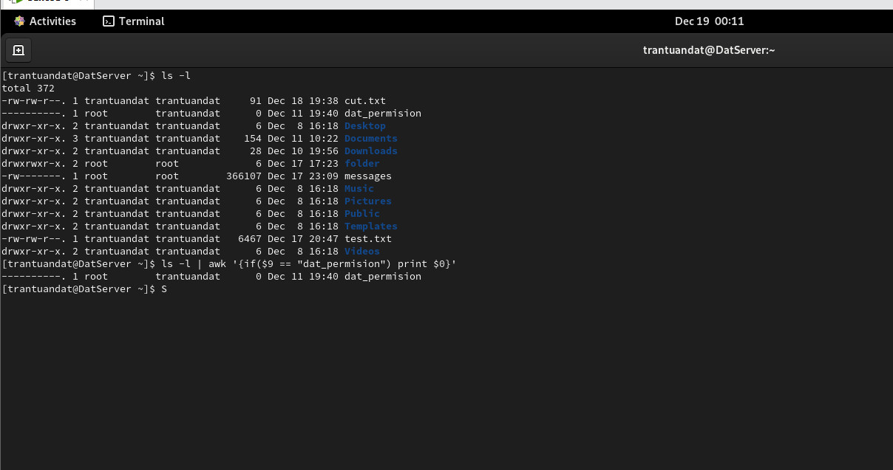
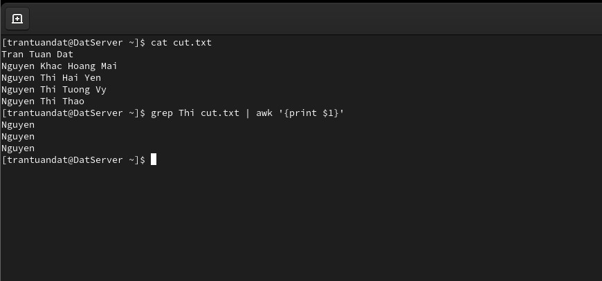

# Khóa học LINUX MASTER

### Syllabus overview (Giáo trình) - Đã tải về

### MODULE 1: Understanding linux concepts

1. WHAT IS LINUX?

- Tự tìm hiểu bằng cách google

2. Unix và Linux

- Unix là gì?
  - Nó là một hệ thống đa nhiệm, đa người dùng và ổn định đối với các máy chủ, máy trạm hoặc các laptop. Các hệ thống UNIX cũng có một giao diện đồ họa (GUI) giống như Windows của Microsoft, tạo sự dễ dàng trong sử dụng
  - Một số phiên bản Unix hiện nay có thể kể đến:
    - HP-UX (HP)
    - AIX (IBM)
    - Solaris (Sun/Oracle)
    - Mac OS X (Apple)

=> Linux được tạo ra với mục đích cung cấp cho người dùng 1 giải pháp phần mềm miễn phí thay thế cho UNIX.

- Unix và Linux:

  - Unix chỉ được cài đặt trên một số phần cứng nhất định tuy nhiên Linux thì có thể cài đặt ở nhiều phần cứng
  - Linux có thể chạy trên rất nhiều nền tảng khác nhau như x86 và x64 từ Intel/AMD trong khi UNIX chỉ chạy trên 1 hoặc 2 kiến trúc nhất định.
  - Unix là một hệ điều hành đóng.

  => Và câu hỏi đặt ra là: Nếu UNIX là nguồn đóng thì tại sao nhiều hãng lại có mã nguồn để phát triển riêng? Câu trả lời có lẽ khiến bạn càng bất ngờ. Ban đầu, UNIX được phân phối cho các trường đại học và những doanh nghiệp có nhu cầu, với đầy đủ mọi thứ từ mã nguồn đến các công cụ lập trình. Nói cách khác, nếu UNIX là 1 chiếc xe thì khách hàng được cung cấp mọi thứ từ bản vẽ đến từng cái tua vít. Cũng chính vì thế mà các trường học và công ty có thể chỉnh sửa, thậm chí viết lại cả HĐH. Linux mặt khác là 1 HĐH mã nguồn mở, người ta có thể tải, sử dụng, chỉnh sửa miển phí mà ko gặp trở ngại về luật bản quyền.

  - Có thể tìm hiểu thêm tại `google`

3. Linux vs Windows

- Price:
  - Linux: Free (Một số phiên bản mất phí)
  - Window: Phải trả phí
- Thân thiện:
  - Window: Thân thiện với người dùng
  - Linux: Không thân thiện với người dùng
- Reliability (Độ tin cậy)
  - Linux: rất đáng tin cậy, có thể chạy chương trình trong nhiều năm, nhiều tháng mà không cần phải khởi động lại máy
  - Window: Thường xuyên yêu cầu khởi động lại
- Software:
  - Linux: Thường dùng cho các phần mềm là chủ yếu
  - Window: Dùng cho văn phòng, phần mềm, games, tiện ích, ...
- Đa nhiệm:
  - Linux: Rất tốt cho đa nhiệm
  - Window: Cần tài nguyên bộ nhớ, CPU mạnh thì mớ hoạt động tốt
- Open source
  - Linux: YES
  - WINDOW: NO
- SECURE (Độ bảo mật):
  - Linux: An toàn
  - Window: kém an toàn
  - Nguyên nhân: Window cho phép người dùng truy cập nhiều ứng dụng hơn => Gia tăng mối nguy cơ về bảo mật (vì các ứng dụng sử dụng internet), mặt khác, hệ điều hành linux là open source, nó cho phép mọi người đâo sâu về nó hơn => Được soi bởi nhiều người thì độ an toàn cũng cao hơn

4. Một số câu hỏi

- Cấu trúc: Hardware => Operating system => aplications => users

### MODULE 2: Download, Install and Configure

1. CentOS vs CentOS Stream

- Dự án CentOS giám sát hai phiên bản của bản phân phối – CentOS Linux và CentOS Stream. Sự khác biệt chính giữa chúng là phiên bản trước là hạ nguồn của Red Hat Enterprise Linux trong khi CentOS Stream là phiên bản ngược dòng chứa các bản cập nhật nhỏ sắp tới của Red Hat.

2. Download CentOS 9 stream

- Lên google search và tải về nhé

3. Virtual Machine Managment

### MODULE 3: SYSTEM ACCESS AND FILE SYSTEM

1. Important things to remember in linux (Một số điều quan trọng trong linux)

- Để thoát con chuột khỏi VM WARE chỉ cần sử dụng phím tắt `ALT + CONTROL`
- Root là người dùng mạnh nhất trên hệ thống (giống như người quản trị viên cúa bạn)
  - Root là tài khoản mạnh nhất có thể tạo sửa đổi xóa tài khoản và thay đổi hệ thống tệp cấu hình
  - Root cũng có thể xóa toàn bộ hệ điều hành
- Linux phân biệt chữa hoa thường (VD: ABC not the same abc)
- Tránh sử dụng khoảng trắng(dấu cách khi tạo file và thư mục)
- Linux Kernel không phải là một hệ điều hành, nó là một phần mềm nhỏ với bất kì hệ điều hành Linux nào nhận lệnh từ người dùng và "pass" chúng thông qua phần cứng hệ thống và thiết bị ngoại vi
- Linux chủ yếu là CLI (Command Line Interface) không phải là GUI (Graphical User Interface)

2. Access to Linux System

- Có hai cách khác nhau để truy cập vào hệ điều hành của mình

  - Console: Truy cập trực tiếp vào hệ điều hành khi nó được kết nối thông qua VGA, HDMI, ... hoặc cáp hiển thị khác...
  - Remote: Truy cập từ xa vào hệ điều hành của bạn thông qua mạng

- Nếu sử dụng máy window để kết nối với linux thì cần tải thêm một client là `putty`, còn nếu đang sử dụng MAC thì không cần phải làm thế, nếu muốn kết nối thì chỉ cần sử dụng dòng lệnh: `SSH 192.168.1.5`, Nếu muốn truy cập vào Linux từ một máy Linux khác thì sử dụng cách giống như với MAC

3. Download and Install Putty

- Putty là một hệ thống cho phép bạn kết nối với hệ thống Linux từ máy tính Window từ xa
- Nếu đang dùng máy window cài máy ảo Linux thì cần cài putty trên hệ điều hành window nhé
- Trên máy Mac hoặc Linux thì chả cần gõ lệnh sau là có thể kết nối từ xa đến máy chủ Linux của bạn: `ssh -l ten_nguoi_dung_dich dia_chi_ip`

- Làm thế nào để lấy được địa chỉ IP trên máy tính?
  - Mở CLI và gõ câu lệnh: `ifconfig` hoặc nếu sử dụng phiên bản CentOS từ 7.5 trở lên thì sử dụng lệnh `ip addr`
  - Nếu muốn sử dụng lệnh `ifconfig` ở phiên bản CentOS > 7.5 thì cần download package: `yum install net-tools`
  - Sau khi gỗ xong câu lệnh trên thì sẽ thấy `inet 192.168.220.131`, hãy coppy địa chỉ ip này và dán vào `putty` vừa được cài đặt ở máy window của bạn

4.  Command Prompts and Getting Prompts Back (Dấu nhắc lệnh và quay trở lại dấu nhắc lệnh)

- Khi vào terminal thì sẽ có một dấu nhắc lệnh hiện lên có dạng: `[root@TranTuanDatServer-]#`
  - `root` ở đây thể hiện bạn đang có quyền quản trị cao nhất trong hệ điều hành
  - `TranTuanDatServer` là tên máy tính của bạn
  - `#`: Nếu ở root thì sẽ hiển thị dấu `#` còn nếu ở người dùng khác root thì sẽ hiển thị `$`
- Để thực hiện một lệnh nào đó thì cần viết sau dấu nhắc lệnh dạng `[root@TranTuanDatServer-]#`, Nếu trong trường hợp không thấy dấu nhắc lệnh thì sử dụng phím tắt `Ctr + C` để quay trở lại dấu nhắc lệnh

5. FileSystem Structure and Description (Cấu trúc Hệ thống file và mô tả)

- Hệ thống tệp là gì?

  - Là một hệ thống được hệ điều hành máy tính sử dụng để quản lí các tệp và thư mục của bạn
  - Hệ thống tệp sẽ kiểm soát cách dữ liệu được lưu hoặc truy xuất từ đĩa cứng máy tính của bạn

- Cấu trúc file trong linux được chia thành các tệp khác nhau:

- `/boot`: Chứa những tập tin liên quan tới chương trình quản lý khởi động máy.
  - Các tập tin initrd, vmlinux, grub được lưu trong thư mục /boot
  - VD: initrd.img-2.6.32-24-generic, vmlinuz-2.6.32-24-genericVí dụ: initrd.img-2.6.32-24-generic, vmlinuz-2.6.32-24-generic
- `/root`: là thư mục chính của người dùng root (Khác với `/` nhé)
- `/dev`: Chứa thiết bị hệ thống như Disk, CdRom, Spreakers, Keyboard, Flash Drive, ...
  - Bất kì thiết bị ngoại vi nào gắn vào hệ thống linux cũng được tạo dưới dạng tệp, nó được hiển thị trong `/dev`
- `/etc`: Là thư mục quan trọng nhất trong hệ thống linux, Nó chứa tất cả các tệp cấu hình.
  - Nếu bạn đang chạy một ứng dụng nào đó trên hệ thống linux hoặc đi kèm với hệ thống linux của bạn thì những file cấu hình của ứng dụng đó được chứa trong `/etc`
  - Nó cũng chứa các đoạn mã khởi động và tắt mà được dùng để khởi động/dừng các chương trình đơn lẻ.
  - Nếu muốn sửa đổi tệp cấu hình của ứng dụng nào đó thì đi tới `/etc` và tìm
  - VD: /etc/resolv.conf, /etc/logrotate.conf
- `/bin` (Trỏ tới `/usr/bin`):
  - Chứa tất cả các lệnh người dùng có thể thao tác với hệ thống linux
  - Chứa các tập tin thực thi
  - VD: Các lệnh được sử dụng bởi tất cả người dùng trong hệ thống được lưu ở đây. Ví dụ: ps, ls, ping, grep, cp.
  - Tập trung các tập tin thực thi, thư viện, tài liệu, và mã nguồn cho các chương trình mức độ thứ hai.
  - `/usr/bin` chứa các tập tin thực thi cho các chương trình của người dùng. Nếu bạn không thể tìm thấy trong thư mục `/bin` thì tìm trong `/usr/bin`. Ví dụ: at, awk, cc, less, scp
  - `/usr/sbin` chứa các tập tin thực thi cho quản trị hệ thống. Nếu bạn không thể tìm thấy trong `/sbin` thì tìm trong `/usr/sbin`. Ví dụ: atd, cron, sshd, useradd, userdel
  - `/usr/lib` chứa các tập tin thư viện `/usr/bin` và `/usr/sbin`
  - `/usr/local` chứa các chương trình của người dùng mà bạn cài từ mã nguồn. Ví dụ, khi bạn cài Apache từ mã nguồn, nó được đưa vào thư mục /usr/local/apache2
- `/sbin` (Trỏ tới `usr/sbin`): Chứa các lệnh System/filesystem
  - Giống như /bin, /sbin cũng chứa các tập tin thực thi
  - Các lệnh được lưu trong thư mục này về cơ bản được dùng cho người quản trị và được dùng để bảo trì hệ thống.
  - VD: iptables, reboot, fdisk, ifconfig, swapon
- `/opt`: Các ứng dụng tùy chọn hay thêm
  - opt là viết tắt của optional
  - Chứa các ứng dụng thêm của các hãng khác nhau.
  - Các ứng dụng thêm nên được cài trong thư mục con của thư mục /opt/
- `/proc` (Thông tin tiến trình):
  - Chứa thông tin về các tiến trình của hệ thống.
  - Như các tập tin chứa thông tin về các tiến trình đang chạy. VD: /proc/{pid} directory >>> lưu thông tin về tiến trình với pid bạn chọn.
  - Hay các tập tin hệ thống ảo với nội dung về tài nguyên hệ thống. VD: /proc/uptime
  - Khi tắt máy => Các tiến trình sẽ đóng => vì thế khi tắt máy sẽ không có gì chứa trong `/proc`
- `/lib` (Trỏ tới `usr/lib`): Chứa tất cả các thư viện lập trình C. Các tệp đó cần thiết cho các lệnh và ứng dụng

  - Chứa các tập tin thư viện để hỗ trợ các tập tin thực thi được lưu trong /bin và /sbin
  - Tên của các tập tin này là ld* hay lib*.so.\*
  - Muốn xem lệnh được sử dụng bởi thư viện nào thì có thể sử dụng: `strace -e open pwd`

- `/tmp`: Sử dụng cho các tệp tạm thời

  - Thư mục chứa các tập tin tạm được tạo bởi hệ thống và người dùng.
  - Các tập tin trong thư mục này bị xóa khi hệ thống khởi động lại.

- `/home`: Thư mục người dùng

  - Chứa các tệp tin của người dùng trong hệ thống
  - VD: `/home/john`, `home/nikita`

- `/var`: Các tập tin biến đổi

  - var là viết tắt của các tập tin biến đổi.
  - Gồm những tập tin mà dung lượng lớn dần theo thời gian sử dụng
    - Chẳng hạn — các tập tin ghi chú hệ thống (/var/log)
    - Các gói và các tập tin cơ sở dữ liệu (/var/lib))
    - thư điện tử (/var/mail)
    - hàng đợi – in queues (/var/spool)
    - các tập tin khóa (/var/lock)
    - các tập tin tạm được dùng khi khởi động lại (/var/tmp)

- `/run`: Đây là nơi hệ thống khởi động ở những giai đoạn rất sớm (VD: systemd and udev), Lưu trữ các tệp thời gian chạy tạm thời như PID

  - Sẽ mất khi hệ thống bị tắt

- `/mnt`: Được dùng để gắn kết hệ thống tệp bên ngoài

- `/media`: Các thiết bị tháo lắp

  - Thư mục chưa các mount tạm thời cho các thiết bị tháo lắp.
  - VD: /medica/cdrom cho CD-ROM; /media/floppy cho ổ đĩa mềm; /media/cdrecorder cho ổ đĩa ghi CD.

- `/srv` – Dữ liệu dịch vụ
  - srv là viết tắt của service.
  - Chứa dữ liệu liên quan tới các dịch vụ trên máy chủ.
  - Ví dụ: /srv/cvs chứa dữ liệu liên quan tới CVS.

### File System Navigation Commands (cd , ls and pwd)

- `cd` (Change directory): Thay đổi thư mục
- `ls` (Listing): Hiển thị danh sách thư mục con trong thư mục hiện tại
- `pwd`: Cho biết vị trí hiện tại mà dấu nhắc lệnh đang trỏ tới
- Lưu ý: `cd` chỉ sử dụng cho Thư mục, không thể sử dụng `cd` cho một file

### Một số lệnh cơ bản khác

- Để vào tài khoản root ta nhấn: `su -`
- `clear`: Xóa màn hình
- `cd`: Đến thư mục của người dùng hiện tại
- `cd ..`: Quay lại thư mục cha
- Để paste văn bản từ máy tính chủ vào máy ảo thì sử dụng `Ctr + Shift + V`
- `cd /tenThuMucXuatHienORoot`: Nếu thư mục này là cấp con đầu tiên của thư mục root thì nó sẽ điều hướng tới, ngay cả khi bạn có đứng ở đâu
- `whoami` Để xem ai là người đăng nhập hiện tại
- `hostname`: Xem hostname của máy

### Lệnh ls

- File ẩn là nhừng file bắt đầu bằng dấu `.`
- `ls`: Xem toàn bộ tên thư mục, file trong thư mục hiện tại
- `ls -l`: Xem toàn bộ folder, file trong thư mục hiện tại (Kèm theo chi tiết, không hiển thị file ẩn)
- `ls -a`: Xem toàn bộ tên folder, file trong thư mục hiện tại (Kể cả file ẩn)

- Khi sử dụng `ls -l` thì nó sẽ hiển thị như dưới đây:


- Giải thích:
  - Trong mỗi dòng xuất hiện dạng `dr-xr-xr-x`, chữ đầu tiên là loại tệp:
    - `d`: directory (Folder)
    - `-`: File
    - `l`: Liên kết

### Linux File or Directory Properties

- Để xem các thuộc tính của nhiều file và folder ta sử dụng `ls -l`


- Trong đó:

  - Cột đầu tiên (Permission modes)
    

  - Cột thứ 2 (Links): Là số lượng liên kết cứng tới thư mục đó

    - Số lượng liên kết cứng là số lượng thư mục con ngay lập tức mà nó có cộng với thư mục mẹ và chính nó

  - Cột Owner: Cho biết ai là chủ của thư mục này
  - Cột Group: Là nhóm sở hữu tệp đó
  - Cột Size: là kích thước của tệp đó (Tính bằng kb)

### Linux file type

- `-`: Regular file
- `d`: Directory
- `l`: link
- `c`: Special file or device file
- `s`: socket
- `p`: Named pipe
- `b`: Block device

### What is root?

- Có 3 loại Root trong hệ thống linux
  - Root account: Root là một tài khoản hoặc người dùng có quyền sử dụng tất cả các lệnh và quyền truy cập vào tất cả các tệp, nó giống như quyền quản trị admin trên hệ thống window
  - Root (/): Thư mục đầu tiên trong hệ thống linux
  - Root home directory: Tài khoản gốc hoặc tài khoản người dùng nào cũng có một thư mục riêng, thư mục đó nằm trong `/home/ten_nguoi_dung`

### Changing Password

- Lệnh thay đổi password của một người dùng nào đó: `passwd userid` (userid chính là tên người dùng)
- Nếu chỉ gõ `passwd` khi bạn đang ở root thì nó sẽ thay đổi mật khẩu tài khoản root
- Chỉ tài khoản root mới có thể chỉ định `userid` để thay đổi mật khẩu của người dùng
- Người dùng không phải root mà muốn thay đổi mật khẩu thì chỉ cần gõ `passwd`

### Absolute and Relative Paths (Đường dẫn tuyệt đối và tương đối)

- Trong Linux có hai loại đường dẫn để điều hướng
  - Absolute path (Đường dẫn tuyệt đối)
    - Đường dẫn tuyệt đối là đường dẫn được bắt đầu bằng: `/`. VD: `cd /var/log/samba`, khi sử dụng đường dẫn tuyệt đối thì dù bạn có đang ở thư mục nào (Có bao nhiêu cấp con đi chăng nữa) thì nó vẫn luôn trỏ lại về thư mục gốc và đi tới đường dẫn mà bạn chỉ định (Bắt đầu từ thư mục gốc)
  - Relative path (Đường dẫn tương đối)
    - Đường dẫn tương đối là đường dẫn không bắt đầu bằng `/`, khi sử dụng đường dẫn tuyệt đối thì nó sẽ sử dụng vị trí hiện tại cộng thêm với đường dẫn mà bạn chỉ định
- Muốn hoàn thành nhanh thư mục thì nhấn `tab`

### Creating Files and Directories (touch, cp, vi, mkdir)

1. Creating file

- `touch file_name`: Tạo một file trống
  - Để tạo nhiều file trống cùng một thời điểm: `touch file_name1 file_name2 ...`
- `cp file_path_source new_file_path_denst`: Coppy một file sang một file khác (Đồng thời tạo file "khác" đó)
- `vi file_name`: Tạo tệp thông qua vi (Trình soạn thảo), đồng thời nó sẽ tạo ra tệp mới luôn (Ngoài ra lệnh này còn có thể giúp chỉnh sửa một file đã có sẵn)
  - Tuy nhiên muốn `vi` tạo ra file mới thì lúc thoát khỏi trình soạn thảo phải lưu nó lại nhé

2. Creating folder

- `mkdir folder_name`: Tạo folder
- Để tạo nhiều folder trên cùng một dòng lệnh: `mkdir folder_name1 folder_name2 ...`

3. Lưu ý

- Để xem các file đã được tạo hoặc sửa đổi lần cuối theo thứ tự thời gian cập nhật từ lâu nhất đến mới nhất: `ls -ltr` (Cái cuối cùng là cái mới nhất)

- Để xem các file đã được tạo hoặc sửa đổi lần cuối theo thứ tự thời gian cập nhật từ mới nhất đến lâu nhất: `ls -lto` (Cái cuối cùng là cái cập nhật lâu nhất)

- Lưu ý: `ltr và lto` nó có ý nghĩa đấy nhé (Lên google search xem)

- Khi ở thư mục người dùng thì chỉ được tạo file trong chính thư mục của mình, không thể tạo trong thư mục của root

### Coppy directories

- Để coppy một directory thì chúng ta cần thêm tùy chọn `-R`
- Lệnh: `cp -R source_folder dest_folder`
- `-R` được viết tắt từ Recursion (Đệ quy)
- Nếu không có option `-R` thì nó sẽ báo lỗi "Không thể sao chép vì đây là một thư mục"

### Finding Files and Directories (find, locate)

- Trong linux có 2 lệnh chính được sử dụng để tìm kiếm files/directories
  - `find`
    - `find -name test1`: Tìm kiếm file có tên là `test1`: Đầu ra giả sử là `./Document/test1`
  - `locate`
    - `locate test1`: Hiển thị vị trí của file/folder có tên là test1: Đầu ra tương tự: `/home/dat/Document/test1`
- Lưu ý: Nếu Output của lệnh `locate` không có bất kì kết quả nào thì phải sử dụng lệnh `updatedb` với quyền ROOT, ngoài ra cần chắc chắn rằng package `mlocate` đã được cài đặt.

  - Để kiếm tra `mlocate` đã cài đặt hay chưa sử dụng: `rpm -qa | grep mlocate`
  - Để install: `yum install mlocate`

- Nếu bạn không biết folder/file muốn tìm bắt đầu từ đâu thì có thể sử dụng:
  - `find */test1`: Tìm kiếm file/folder kết thúc bằng test1
  - `find . -name "test1"`: Tìm file/folder có tên là `test1`
  - `find / -name "ifcfg-enp0s3"` (Lệnh này phải chạy sudo nhé) Nó sẽ tìm kiếm ngoài root (absolute path)
  - Lưu ý: Khi chạy `find / ...` thì nó sẽ ra ngoài root và tìm từng folder một, nếu không bật mode root thì sẽ báo lỗi `access denind`
- Alias
  - `*`: Bất kì đường dẫn nào đều hợp lệ

### Difference between find and locate

- `locate`: sử dụng một cơ sở dữ liệu được xây dựng trước, cơ sở dữ liệu này được cập nhật thường xuyên

- `find`: lặp qua hệ thống tệp để định vị tệp

=> Nhận xét: Vì lý do trên, `locate` sẽ xác định vị trí nhanh hơn nhiều so với `find`, tuy nhiên có thể không chính xác (khi dùng `locate`) nếu database (có thể gọi là được cache) không được cập nhật

- Khi hệ thống tệp được cập nhật thì từ vài phút đến vài giờ sau hệ thống linux sẽ tự động cập nhật cơ sở dữ liệu => Nếu muốn nó được cập nhật luôn thì phải chạy lệnh `updatedb`

### Wild Cards

- Một `Wild cards` là một thẻ đại diện cho kí tự, nó có thể được sử dụng để thay thế cho bất kì lớp kí tự nào trong hộp tìm kiếm

1. Một vài wild cards hay sử dụng

- `*`: Đại diện cho 0 hoặc nhiều kí tự
- `?`: Đại diện cho một kí tự
- `[]`: Đại diện cho những kí tự được truyền vào

- Ví dụ trong hệ thống tệp linux của bạn có 5 file như sau:
  - `abc-x1`
  - `abc-x2`
  - `abc-x3`
  - `abc-x4`
  - `abc-x5`

=> Nếu muốn xóa hết các file thì sử dụng `rm abc*`

- `touch abcd{1..9}-xyz`: Tạo ra 9 file
- `ls -l abc*`: Liệt kê tên của tất cả các file có tên bắt đầu bằng `abc`
- `rm *xyz`: Xóa mọi thứ kết thúc là `xyz`
- `ls -l ?abc*`: Hiển thị tất cả các file/folder có tên bắt đầu bằng 1 kí tự bất kì + abc + mọi thứ đều hợp lệ
- `ls -l *[abc]*`: Hiển thị tất cả các file/folder có các kí tự `abc` trong tên (Chỉ cần chứa 1 kí tự là thỏa mãn), Vì cái này có nhiều output nên mình sử dụng lệnh sau để xem trên nhiều trang: `ls -l *[ab]* | more`
- `rm *xy*`: Xóa toàn bộ tệp có `xy` ở trong tên

2. other wild cards

- Còn nhiều cái khác, lên google tra nhé

### Soft and hard links (Liên kết mềm và liên kết cứng)

- Mỗi khi tạo một tệp thì máy tính sẽ gán một một số cho tệp đó trên đĩa cứng và liên kết số, số đó được gọi là `inode`, mỗi khi chúng ta cố gắng truy xuất hoặc đọc tệp thì nó sẽ truy xuất số đó

- Liên kết mềm (Soft link) là một liên kết được tạo và nó sẽ bị xóa nếu một tệp bị xóa hoặc đổi tên

  - Tạo liên kết mềm bằng cách: `ln -s`

- Liên kết cứng (Hard link): Khi xóa hoặc đổi tên tệp nguồn thì liên kết cứng cũng sẽ không thay đổi

  - Tạo liên kết cứng bằng cách: `ln`

- Theo dõi hình ảnh dưới đây:
  

=> Do `hard links` liên kết trực tiếp với inode nên nó không bị mất đi khi file bị xóa hay đổi tên
=> Do `soft links` liên kết với `inode` thông qua tệp nên dĩ nhiên nó sẽ mất khi file bị xóa hoặc thay đổi

- NOTE: Không thể tạo soft link hay hard link trong cùng một tên, đó là lý do tại sao phải cd tới tmp trong ví dụ dưới đây


- Để viết nội dung vào tệp sử dụng: `echo "hulk is supperman" > hulk` (Viết nội dung trong dấu ngoặc kép vào file có tên là `hulk`)
- Sau khi viết nội dung vào trong file gốc thì khi ở file liên kết ta cũng sẽ thấy nội dung này

- Để xem số `inode` ở mỗi file: `ls -ltri`: Số đầu tiên chính là `inode`
- Để xem `inode` của một file cụ thế; `ls -ltri path_file`
- Lưu ý: chỉ số `inode` ở file gốc và file liên kết mềm là khác nhau


- Ví dụ về tạo liên kêt cứng (Hard links), liên kết này vẫn tồn tại khi xóa nó ở thư mục gốc


=> Nhìn ảnh thì chúng ta biết kí tự đầu tiên của `hulk` trong `/tmp` là `-` => Điều này chứng tỏ nó không được liên kết với file nào cả => Đây là sự khác biệt giữa `Hard links` và `Sort Links`

- Khi thêm nội dung vào file sử dụng `echo "content..." > file_path` thì nó sẽ ghi đè nội dung mới nhất vào nội dung hiện tại. Còn nếu sử dụng `echo "content..." >> file_path` thì nó sẽ ghi vào dưới cùng của file hiện tại

### Linux command syntax

- Để tìm hiểu cú pháp của một lệnh thì ta sử dụng: `man command_name`
- Mỗi câu lệnh sẽ có option đi kèm, google để biết thêm thông tin chi tiết nhé

### Files and Directory Permissions (chmod)

- Unix là hệ thống nhiều người dùng, mọi file, folder trong tài khoản của bạn đều được bảo vệ hoặc có thể làm cho người dùng khác có thể truy cập nó bằng cách thay đổi quyền của nó
- Quyền của file hoặc directory có thể bị hạn chế bởi loại tệp
- Có 3 quyền sau:

  - `r`: read
  - `w`: write
  - `x`: excute = runing a program (Nếu đó là một chương trình, nếu bản thân tệp là một tập lệnh hoặc một chương trình, thì nó có quyền `x` => Nếu người dùng được phép chạy một chương trình, họ sẽ có quyền thực thi đối với nó)

- Mỗi quyền (`rwx`) có thể được kiểm soát với 3 cấp độ khác nhau:
  - `u`: user (yourself)
  - `g`: group (Có thể là những người trong cùng một dự án hoặc nhóm)
  - `o`: other (Tất cả mọi người trên hệ thống)
- Quyền của tập tin hoặc thư mục được hiển thị thông qua lệnh: `ls -l command`

  - Nó có dạng như sau: `-rwxrwxrwx` (Những nhóm trong kí hiệu này đã được giải thích ở những bài trước, nếu không thấy thì có thể google nhé)

- Lệnh thay đổi quyền: `chmod`

- Hình sau đang thực hiện xóa quyền `x` trong file `dat_permision` ở `group`
  

- Hình sau đang thực hiện xóa quyền `w` cho `a` (all user)
  

- `chmod u+rwx dat_permision`: Thêm quyền cho file/folder được chỉ định ở `u` (user)

- Ví dụ sau thêm quyền `rw` ở nhóm `u` (user)
- Câu hỏi: Tại sao trong các thư mục trên lại có quyền `x`? Có phải thư mục là một tập lệnh (Script) nên nó mới có quyền `x` (Thực thi)

  - Trả lời: thư mục không phải là một tập lệnh, sở dĩ nó có quyền `x` để chúng ta có quyền `cd` vào nó

- Tổng kết:
  - Cú pháp: `chmod [OPTIONS] MODE FILE...`
  - Cú pháp của lệnh chmod khi sử dụng chế độ symbolic như sau: `chmod [OPTIONS] [ugoa…][-+=]perms…[,…] FILE...`
    - Tham số `ugoa` là nhóm đối tượng nào sẽ được xử lý quyền:
      - u =` Chủ sở hữu (owner)
      - g = Nhóm người dùng (group)
      - o = Người dùng khác (other)
      - a = Tất cả user (all)`
      - Nếu bạn không truyền tham số này vào lệnh thì nó sẽ lấy giá trị mặc định là a.
    - Tham số thứ hai là [-+=], dùng để xác định quyền sẽ được xóa, thêm hoặc thiết lập mới.
      - Dấu `-` là xóa bớt quyền
      - Dấu `+` là thêm quyền
      - Dấu `=` là gán lại quyền

### File Permissions Using Numeric Mode

- `0`: No permision
- `1`: Excute
- `2`: Write
- `4`: Read
- Set quyền bằng cách cộng các quyền trên lại
- Lệnh: `chmod number path_file`
- Để xóa toàn bộ quyền: `chmod 000 path_file`


### File Ownership (Quyền sở hữu tệp)

- Quyền sở hữu tệp được tạo ra ở cấp độ người dùng và cấp độ nhóm
- Có 2 chủ sở hữu của một tệp hoặc thư mục:
  - User (Người tạo tệp /thư mục)
  - Group
- Lệnh để thay đổi file ownship

  - `chown` và `chgrp`
    - `chown`: Thay đổi chủ sở hữu của một file
    - `chgrp`: Thay đổi sở hữu nhóm của một file
  - Option:
    - `-R`: Thay đổi quyền của thư mục mẹ và cả những thư mục bên trong nó nữa

- Để thay đổi được các quyền sở hữu của một file bạn cần trong quyền `sudo`

  - Để thay đổi user: `sudo chown <username> <filename>`
  - Để thay đổi group: `sudo chgrp <groupname> <filename>`
  - Để thay đổi cả user và group: `sudo chown <username>:<groupname> <filename>`

- Để thoát khỏi người dùng root: `exit`

### Access Control List (ACL)

- ACL cung cấp một cơ chế cấp phép bổ sung, linh hoạt cho các hệ thống tệp, nó được thiết kế để hỗ trợ quyền với tệp UNIX, Nó cho phép bạn cấp quyền cho bất kì người dùng hoặc nhóm nào đối với bất kì disk resources nào
- Mục đích của việc sử dụng ACL:
  - Hãy nghĩ về một tình huống trong đó một người dùng cụ thể không là một thành viên trong nhóm mà bạn tạo ra, vì vậy nếu bạn tạo ra người dùng ABC và đó không phải là thành viên của group root, nhưng bạn vẫn muốn cấp cho một số quyền đọc hoặc ghi => Làm thế nào mà bạn có thể làm điều này mà không đặt người dùng đó thành thành viên của nhóm? => ACL giúp chúng ta làm điều đó
- Chúng ta có thể làm điều này bằng cách thay đổi quyền của nhóm `other`, tuy nhiên chúng ta chỉ muốn chỉ định quyền này cho một người duy nhất, việc thay đổi quyền của nhóm `other` làm cho tất cả những người dùng khác có được quyền này => Điều đó là không khả thi
- ACL được sử dụng để xác định quyền truy cập tùy ý chi tiết hơn cho các tệp và thư mục
- Các lệnh được sử dụng để gán và loại bỏ quyền ACL là: (Các lệnh này cung cấp thông tin về các quyền hiện có của tệp và cho phép bạn thiết lập theo cách mà bạn muốn)

  - `setfacl`
  - `getfacl`

- List of commands for setting up ACL:

  1. To add permision for user

  - `setfacl -m u:user:rwx /path/to/file`

  2. To add permision for group

  - `setfacl -m g:group:rw /path/to/file`

  3. To allow all files or directories to inherit ACL, entries from the directory it is within

  - `setfacl -Rm "entry" /path/to/dir`

  4. To remove a specify entry

  - `setfacl -x u:user /path/to/file` (Chỉ dành cho một người dùng cụ thể)

  5. To remove all entries

  - `setfacl -b path/to/file` (For all users)

- Note:

  - Mỗi khi gán quyền `ACL` cho một file/directory, nó sẽ thêm một dấu `+` ở cuối quyền
  - Thiết lập với quyền `w` với `ACL` không cho phép bạn xóa một tệp

- Ví dụ:
- Ta có file sau, ta muốn chỉ định duy nhất một người dùng có quyền `rw`
  

- Làm như sau:
  

- Sử dụng gạch thứ 4
  

- Muốn set toàn bộ quyền về như cũ thì sử dụng gạch đầu dòng thứ 5

### Help conmmand

- There are 3 types of help command
  - `whatis` + command_name
  - command_name + `--help`
  - `man` + command_name
- Nếu thử các cách trên mà không được thì cần thực hiện `sudo mandb -c`, nếu không được nữa thì google

- NOTE: Dùng lệnh `man` sẽ tốt hơn vì nó sẽ hiển thị chi tiết về command_name

### TAB Completion and Up Arrow

- Sử dụng tab để hoàn thành một path_file:
  - VD: `ls dat + TAB` thì nó sẽ tự động hoàn thành nếu trong thư mục hiện tại của bạn có duy nhất file có tên bắt đầu bằng `dat`
  - Còn nếu trong thư mục có nhiều file có tên bắt đầu bằng `dat...` thì sử dụng hai dấu `TAB` nó sẽ hiển thị tất cả những file bắt đầu bằng `dat` đó
- Sử dụng `TAB` để hoàn thành nhanh một lệnh: Giả sử bạn muốn gõ lệnh `chmod` thì chỉ cần gõ `ch` sau đó bấm TAB thì nó sẽ tự động hoàn thành cho bạn (Chỉ hoàn thành nếu chỉ có một lệnh bắt đầu bằng `ch`, Nếu có nhiều lệnh bắt đầu bằng `ch` thì gõ hai lần `TAB` nó sẽ hiển thị tất cả các lệnh đó)

- Sử dụng phím mũi tên lên khi muốn quay lại command trước đó

### Adding text to file (Redireacts)

- Có 3 cách đơn giản để thêm văn bản vào trong file:
  - `vi`
  - Redireact command ouput > or >>
  - echo > or >>
    - VD: `echo "Hello everyone" >> file_name`
- Sự khác nhau giữa `>` và `>>`

  - `>`: Ghi đè vào file
  - `>>`: Chèn vào cuối file

- Xuất một danh sách thư mục vào một file (Theo thứ tự thời gian gần nhất): `ls -ltr > ds`

=> Rút ra nhận xét rằng, những lệnh nào hiển thị dạng console(Đầu ra của một lệnh trên cửa sổ console) đều có thể viết vào file:

- Ví dụ: `echo "Helo"` xuất ra chữ `Hello` ở dạng console, `date` in ra console ngày hiện tại

### Input and Output Redirects (>, >>, <, stdin, stdout and stderr) && Overview

- There are 3 redirects in Linux

  1. Standard input (stdin) and it has file descriptor number as 0
  2. Standard output (stdout) and it has file descriptor number as 1
  3. Standard error (stderr) and it has file descriptor number as 2

- Trước khi đi vào các lệnh, chúng ta biết rằng chương trình đều sinh ra ouput, output thì thường bao gồm 2 phần, output mong muốn của chương trình và các error messages
- Một chương trình chạy trên linux sẽ gửi đầu ra vào một file đặc biệt là stdout (standard output) và error messages đến stderr (standard error). Hai file này được link đến màn hình và không được save lại trong file.
- Thêm vào đó, các chương trình thường lấy đầu vào từ stdin (standard input) được attach với bàn phím.
- I/O rediretion cho phép chúng ta thay đổi nơi output ra và nơi input đến.

a. Redirect standard output

Để redirect output của một lệnh hay một chương trình ra một file khác stdout, chúng ta sử dụng ký hiệu > [file_name]. Ví dụ, để redirect output của lệnh ls ra một file tên foo.txt

```
/tmp ls > foo.txt
➜  /tmp
➜  /tmp ls -l foo.txt
-rw-rw-r-- 1 hunguyen hunguyen 405 Th05 19 11:36 foo.txt
```

- Chúng ta sẽ thấy lệnh trên không in kết quả vì kết quả đã được redirect đến foo.txt rồi.
- Vậy nếu ta thực hiện lệnh trên với một directory không tồn tại thì sao?

```ubuntu
➜  /tmp ls /foo/bar > foo.txt
ls: cannot access '/foo/bar': No such file or directory
➜  /tmp ls -l foo.txt
-rw-rw-r-- 1 hunguyen hunguyen 0 Th05 19 11:40 foo.txt
```

- Chúng ta vẫn thấy kết quả lỗi in ra màn hình vì chúng ta mới chỉ redirect output thôi còn error thì vẫn được lưu trong stderr, file foo.txt thì không có gì vì output không trả ra gì cả.

- Chúng ta có thể thấy là file foo.txt bị overwrite vì chúng ta đang sử dụng >, để append vào file output chúng ta phải sử dụng >>. Ví dụ:

```ubutu
➜  /tmp ls -l foo.txt
-rw-rw-r-- 1 hunguyen hunguyen 20769 Th05 19 11:44 foo.txt
➜  /tmp ls /home/hunguyen >> foo.txt
➜  /tmp ls -l foo.txt
-rw-rw-r-- 1 hunguyen hunguyen 21006 Th05 19 11:45 foo.txt
```

b. Redirect standard error

- Một chương trình có thể sinh ra output trên rất nhiều file streams.
- Chúng ta đã biết 3 loại file stream là stdin, stdout, stderr.
- Shell tham chiếu chúng tương ứng với 3 file descriptor là 0, 1, 2.
- Shell cho phép chúng ta định nghĩa I/O redirecion bằng cách sử dụng file descriptor number.

=> Để redirect error chúng ta file sử dụng file descriptor tương ứng là 2:

```unbutu
➜  /tmp ls /foo/bar 2> foo-error.txt
➜  /tmp
➜  /tmp ls -l foo-error.txt
-rw-rw-r-- 1 hunguyen hunguyen 56 Th05 19 11:58 foo-error.txt
```

=> như vậy chúng ta đã không thấy output error trên màn hình nữa mà nó đã được update trong file foo-error.txt

c. Redirect output & error ra cùng một file

- Chúng ta có thể sử dụng một trong các cách sau để redirect cả error và output ra cùng một file

```ubuntu
ls -l /bin/usr > ls-output.txt 2>&1
ls -l /bin/usr &> ls-output.txt
ls -l /bin/usr &>> ls-output.txt
```

- Cách đầu tiên là cách thực hiện trong shell ở các phiên bản cũ: redirect stdout ra một file sau đó redirect stderr ra stdout (lưu ý đúng thứ tự trên nếu không sẽ không chính xác).
- Cách thứ hai là là cho các version đến hiện tại của shell
- Dòng 3 là redirect và append vào một file.

d. Loại bỏ những đầu ra không mong muốn

- Đôi khi chúng ta có thể không muốn nhìn thấy output của chương trình ra màn hình lẫn ra file. Hệ thống cung cấp một cách để redirect những đầu ra này ra một file đặc biệt gọi là /dev/null. File này chấp nhận đầu vào và không làm gì với nó cả. Để loại bỏ những error message không mong muốn chúng ta có thể thực hiện lệnh sau:

```unbutu
ls -l /bin/usr 2> /dev/null
```

e. Redirect standard input

- Trước hết chúng ta sẽ giới thiệu về lệnh `cat`. Lệnh `cat` dùng để nối các file và redirect chúng ra stdout:

```unbuntu
cat [file...]
```

- trong đó [file...] có thể là một hoặc nhiều file.

- nếu chúng ta sử dụng cat mà không truyền vào tham số nào. Nó sẽ nhận nội dung chúng ta nhận vào bàn phím và in chúng ra màn hình, sau khi chúng ta nhấn `ctrl+d`.

```ubuntu
➜  ~ cat
this is a demo
this is a demo
➜  ~
```

- chúng ta cũng có thể redirect đầu ra của lệnh cat vào một file, làm cat giống như một dummy text editor

```ubuntu
➜  /tmp cat > foo.txt
This is a demonstration
➜  /tmp cat foo.txt
This is a demonstration
```

- Sau đây là cách chúng ta có thể redirect stdin, chuyển input từ 1 file thay vì bàn phím:

```ububtu
➜  /tmp cat < foo.txt
This is a demonstration
```

- Nhìn ví dụ trên thì có vẻ hơi dummy nhưng đó chính là cách chúng ta hiểu về redirect input với operator <, mặc dù việc này không cải thiện việc dùng câu lệnh cat chút nào.

f. Pipelines

- Pipeline là chức năng redirect standard output của một command đến standard input của một command khác bằng operator `|`
- Chúng ta có thể hiển thị content của một directory lớn trong less để có thể search, hiển thị phân trang:

```unbuntu
$ ls -l /usr/bin | less
```

- Filters

  - Chúng ta có thể sử dụng filter trong pipeline để biến đầu ra (output của một lệnh) thành kết quả mong muốn rồi đưa ra standard output.
  - Các filter phổ biến là: sort, uniq
  - Ví dụ, để nhìn thấy list uniq của một vài directory trong less:

    > $ ls /bin /usr/bin | sort | uniq | less

  - Hoặc chúng ta có thể sử dụng option -d của uniq để chỉ nhìn thấy list những dòng có từ một lần xuất hiện trở lên

- `wc - line, word, byte count`

  - câu lệnh wc dùng để đếm dòng, từ, byte trong một file. Chúng ta có thể dùng nó để đếm số uniq file, directory trong một directory.

  ```ubuntu
  $ ls /bin /usr/bin | sort | uniq | wc -l
  2728
  ```

g. `grep`

- Có lẽ chúng ta đã quá quen với lệnh grep rồi, dùng để match tên file/directory nội dung file. Khi gặp một file có chứa pattern cần search nó sẽ in dòng đó ra standard output

- Câu lệnh: `grep pattern [file...]`
- VD:

```ubuntu
➜  /tmp ls /bin /usr/bin | sort | uniq | grep zip
bunzip2
bzip2
bzip2recover
funzip
gpg-zip
gunzip
gzip
mzip
preunzip
prezip
prezip-bin
unzip
unzipsfx
zip
zipcloak
zipdetails
zipgrep
zipinfo
zipnote
zipsplit
```

h. Lệnh `head/tail`

- Hai câu lệnh trên tương ứng để in ra phần đầu và phần cuối của file. Mặc định chúng sẽ in ra 10 dòng đầu hoặc cuối của một file. Chúng ta có thế sử dụng option `-n [number of lines]` để định nghĩa số dòng muốn in ra
- VD

```ubuntu
➜  /tmp ls /bin /usr/bin | sort | uniq | head -n 4

[
2to3
2to3-2.7
➜  /tmp ls /bin /usr/bin | sort | uniq | tail -n 4
zmore
znew
zsh
zsh5
```

- `tail` có một option -f mà chắc ai cũng biết để output realtime content của một file.

- `tee`: đọc stdin và redirect nó ra một hoặc nhiều file khác nhau, chúng ta dùng nó để ghi lại một kết quả cụ thể trong một đoạn nhất định của pipelines, tưởng tượng nó là ống nước chữ T để chia nguồn nước vậy

```ubuntu
➜  /tmp ls /usr/bin | tee ls.txt | grep zip
funzip
gpg-zip
mzip
preunzip
prezip
prezip-bin
unzip
unzipsfx
zip
zipcloak
zipdetails
zipgrep
zipinfo
zipnote
zipsplit
➜  /tmp head ls.txt
[
2to3
2to3-2.7
2to3-3.5
411toppm
7z
7za
a11y-profile-manager-indicator
aa-enabled
aclocal
```

- Một ví dụ khác về gửi mail: `mail -s "Office memo" dat130902@gmail.com < memoletter`

### Standard output to a file (tee command)

1. TỔNG QUAN

- `tee` là câu lệnh dùng để lưu trữ và xem đồng thời cả kết quả đầu ra của bất kì lệnh nào
- Về cơ bản, lệnh này phá vỡ đầu ra của một chương trình để nó có thể được hiển thị trên màn hình và vừa có thể được lưu thành một tệp


- Ta có ví dụ sau:

  - `echo "Hello everyone" > hello.txt` => Lệnh này thực hiện ghi nội dung vào tệp, tuy nhiên nó không hiển thị ra màn hình
  - Muốn nó vừa lưu, vừa hiển thị ra màn hình thì làm như sau: `echo "Hello everyone" | tee hello.txt `
  - Mỗi lần thực hiện như trên thì nó sẽ xóa tệp và tạo tệp mới sau đó ghi nội dung mới vào tệp

  => Muốn nó ghi vào cuối thì làm như sau: `echo "Hello everyone" | tee -a hello.txt `

- Xem số kí tự của một file thì ta sử dụng: `wc -c hello.txt` (-c ở đây là character)
- Xem danh sách tệp hiện tại đồng thời lưu nó vào một tệp: `ls -l | tee listdir.txt`
- Xem danh sách tệp hiện tại đồng thời lưu nó vào nhiều file khác nhau: `ls -l | tee listdir1.txt listdir2.txt...`

2. CHI TIẾT
   a. SYNTAX: `tee [OPTION]...[FILE]...`

b. OPTION:

- `-a `: Không ghi đè lên tệp mà nối vào cuối tệp
- Tìm hiểu thêm trên google nhé

### Pipes (|)

1. Overview

- `Pipes` (Đường ống) là một dạng redirection(Chuyển standard output sang một số đích khác), nó được sử dụng trong linux và các hệ điều hành giống Unix khác để gửi đầu ra của một lệnh/ chương trình/ tiến trình khác để xử lí thêm. Các hệ điều hành Unix/Linux cho phép đầu ra tiêu chuẩn của một lệnh được kết nối đến đầu vào tiêu chuẩn của một lệnh khác
- `Pipe` được sử dụng để kết hợp hai hoặc nhiều câu lệnh và trong đó, đầu ra của một lệnh đóng vai trò là đầu vào của một lệnh khác và đầu ra của lệnh này có thể lại đóng vai trò là đầu vào của lệnh tiếp theo... Nó cũng có thể được hình dung như một kết nối tạm thời giữa hai hay nhiều lệnh / chương trình/ tiến trình, các chương trình dòng lệnh thực hiện xử lí tiếp theo được gọi là filters(Bộ lọc)
- Kết nối trực tiếp này giữa các lệnh/ chương trình/ tiến trình cho phép chúng hoạt động đồng thời và cho phép dữ liệu được truyền liên tục giữa chúng thay vì phải truyền qua các tệp văn bản tạm thời hoặc qua các màn hình hiển thị
- `Pipes` là một chiều, tức là dữ liệu chảy từ trái qua phải thông qua các pineline.

2. Details
   a. SYNTAX:

- `command_1 | command_2 | command_3 | .... | command_N`
  b. EX:
- VÍ DỤ 1:

  - Thực hiện liệt kê các tệp, sau đó đưa chúng làm đầu vào của lệnh `more`: `ls -l | more`

    - Output:

      

    - Lệnh trên tương đương với dãy lệnh sau:

  ```ubuntu
    ls -l > temp
    more < temp
    rm temp
  ```

- VÍ DỤ 2:

  - Sử dụng `sort` và lệnh `uniq` để sắp xếp một file và in ra các giá trị duy nhất: `sort record.txt | uniq`
  - 

- VÍ DỤ 3:

  - Sử dụng `head` và `tail` để in các dòng trong một phạm vi cụ thể trong một tệp: `cat sample2.txt | head -7 | tail -5`
  - Lệnh trên chọn 7 dòng đầu tiên thông qua lệnh `head -7` và lệnh đó sẽ được nhập vào lệnh `tail -5`, cuối cùng sẽ in ra 5 dòng cuối cùng của 7 dòng đó

- VÍ DỤ 4:

  - Sử dụng `cat, grep, tee và wc` để đọc mục nhập cụ thể từ người dùng và lưu trữ trong một tệp và in số dòng: `cat result.txt | grep "Rajat Dua" | tee file2.txt | wc -l`
  - Lệnh trên sẽ select "Rajat Dua" và lưu chúng trong file `file2.txt` và in tổng số dòng phù hợp với "Rajat Dua"

  - 

### File Maintenance Commands (cp, rm, mv, mkdir, rmdir)

- `cp`: Coppy từ tệp này sang tệp khác
- `rm`: Xóa file
- `mv`: Di chuyển tệp
- `mkdir`: Tạo tệp
- `rmdir`: Xóa thư mục (Có thể sử dụng `rm -r`)

1. Lệnh `cp`

- Giả sử ta có một file `test1.txt` chứa nội dung "Hello world", ta muốn coppy file này sang một file khác có tên là `test2.txt` thì chỉ cần thực hiện như sau: `cp test1.txt test2.txt` (Lưu ý, khi thực hiện câu lệnh này nếu file test2.txt chưa tồn tại thì nó sẽ tự động tạo nhé, còn nếu file test2.txt đã tồn tại rồi thì nó sẽ ghi đè lên file này)
- VD: cp file log: `cp /var/log/messages .` (Dấu `.` đại diện cho thư mục hiện tại đang trỏ tới)

2. Lệnh `rm` được sử dụng để xóa một file

- SYNTAX: `rm file_path`

3. Lệnh `mv` được sử dụng để di chuyển một file

- SYNTAX sử dụng để di chuyển file tới một folder: `mv file_path folder_path`
- SYNTAX sử dụng để thay đổi tên file: `mv filen_name_old file_name_new` (Lưu ý, nếu file_name_new chưa được tạo thì nó tự tạo, nếu file_name_new được tạo rồi thì nó sẽ ghi đè)

4. Lệnh `mkdir` được sử dụng để tạo một folder mới

- SYNTAX: `mkdir file_path_name`

5. `rmdir`

- SYNTAX: `rmdir file_path`
- Cú pháp trên chỉ xóa được những folder trống thôi
- `rm -Rf` sẽ mạnh tay gỡ bỏ tất cả các thư mục con và nội dung trong nó

6. Thay đổi quyền sở hữu nhanh

- Giả sử ta có folder `folder` đang có quyền sỡ hữu `owner` và `group` là `trantuandat`


=> Nếu muốn thay đổi `owner` thành `root` và `group` thành `root` thì cần thực hiện như sau:

- `sudo chown root trantuandat`
- `sudo chgrp root trantuandat`

- Tuy nhiên 2 lệnh trên có thể được viết rút gọn thành một lệnh như sau: `sudo chown root:root folder`

Và đây là kết quả:


### File Display Commands (cat, less, more, head, tail)

1. `cat`

- Xem toàn bộ nội dung trong file

2. `more`

- Xem toàn bộ nội dung trong file , tuy nhiên ban đầu nó chỉ hiển thị trang đầu tiên, để xem tiếp nội dung bấm `Enter` nó sẽ cuộn từng dòng tiếp theo, bấm `Space` nó sẽ hiển thị trang tiếp theo
- Lệnh `more` là một lệnh tiện dụng, thế nhưng nó cũng có một vài nhược điểm, khi ta close một file thì toàn bộ nội dung file này sẽ hiển thị ở cửa sổ terminal. Người dùng cần `clear` màn hình mỗi khi đọc xong file

3. `less`

- Xem toàn bộ nội dung trong file nhưng hiển thị từng dòng một
- `less` sinh ra để giải quyết vấn đề của `more`, nó có chức năng giống như more nhưng khi close file nó sẽ không giữ nội dung file trên màn hình terminal
- Lệnh `less` cũng đi kèm với chức năng tìm kiếm tích hợp, nó cho phép bạn đánh dấu các phần của tệp mà bạn đang tìm kiếm, để tìm kiếm thì bạn cần gõ `/ten_noi_dung_ban_muon_tim` (Khi bạn đang ở chế độ xem với less, thực hiện đăng sau dấu `:`)

4. `head`

- Xem số lượng dòng đầu tiên (số lượng này được quy định trong option)
- Xem hai dòng đầu tiên trong file `messages`: `head -2 messages`

5. `tail`

- Xem số lượng dòng cuối cùng của file(số lượng này cũng được quy định trong option của câu lệnh)
- Xem hai dòng cuối cùng trong file `messages`: `tail -2 messages`

### Filters / Text Processing Commands (Bộ lọc, bộ xử lí văn bản)

- `cut`
- `awk`
- `grep and egrep`
- `sort`
- `uniq`
- `wc`

### Cut command

1. Overview

- Lệnh `cut` trong UNIX là lệnh được sử dụng để cut các phần tử của mỗi dòng và ghi kết quả vào đầu ra tiêu chuẩn. Nó có thể được sử dụng để cắt các phần của một dòng theo vị trí byte. Về cơ bản, lệnh `cut` cắt một dòng và trích xuất văn bản. Khi sử dụng lệnh này cần chỉ định cho nó option, nếu không nó sẽ báo lỗi
- Nếu có nhiều tên tệp được cung cấp thì dữ liệu từ mỗi tệp không được đặt trước tên tệp của nó

2. DETAILS

- SYNTAX: `cut OPTION... [FILE]...`
- Để kiểm tra version của phiên bản hiện tại: `cut --version`
- Lấy ra toàn bộ kí tự đầu tiên của mỗi dòng: `cut -c1 file_name`
- Lấy ra kí tự được chỉ định của mỗi dòng: `cut -c2,3,4,5 file_name`
- Lấy ra vị trí (range) được chỉ định: `cut -c1-5 file_name` (Lấy ra từ kí tự đầu tiên đến kí tự thứ năm)
- Lấy ra vị trí (range) được chỉ định: (Nhiều khoảng) `cut -c1-5,7-9 file_name` (Lấy ra từ kí tự đầu tiên đến kí tự thứ năm và kí tự thứ 7 đến 9 của dòng)

**OPTIONS**:

a. `-b`(byte): Trích xuất các byte cụ thể, bạn cần phải tuân theo tùy chọn `-b` với danh sách các số byte được phân tách bằng dấu `,`, Phạm vi byte cũng có thể được chỉ định bằng dấu gạch nối `-`, `TAB và BACKSPACE` được xử lí như một kí tự byte

```ubuntu
$ cat state.txt
Andhra Pradesh
Arunachal Pradesh
Assam
Bihar
Chhattisgarh

$ cut -b 1,2,3 state.txt
And
Aru
Ass
Bih
Chh

$ cut -b 1-3,5-7 state.txt
Andra
Aruach
Assm
Bihr
Chhtti

$ cut -b 1- state.txt (Biểu thị từ bit đầu tiên đến bit cuối cùng)
Andhra Pradesh
Arunachal Pradesh
Assam
Bihar
Chhattisgarh

$ cut -b -3 state.txt (Biểu thị từ bit đầu tiên đến bit thứ 3)
And
Aru
Ass
Bih
Chh
```

b. `-c` (column): Để cắt theo kí tự sử dụng tùy chọn `-c`. Đây có thể là các số được phân tách bằng dấu `,` hoặc một dãy số được phân tách bằng dấu `-`. `TABS and BACKSPACE` được coi là một kí tự - SYNTAX: `$cut -c [(k)-(n)/(k),(n)/(n)] filename` - `k` biểu thị cho vị trí bắt đầu của kí tự và `n` biểu thị cho vị trí kết thúc của kí tự trong từng dòng (nếu k và n được phân tách bởi dấu `-`, nếu không chúng chỉ là vị trí của từng kí tự trong mỗi dòng từ tệp được lấy dưới dạng đầu vào)

```ubuntu
$ cut -c 2,5,7 state.txt  (Lệnh này cắt kí tự 2 5 7 của mỗi dòng)
nr
rah
sm
ir
hti

$ cut -c 1-7 state.txt  (Lệnh này cắt từ kí tự đầu tiên đến kí tự thứ 7 của mỗi dòng)
Andhra
Arunach
Assam
Bihar
Chhatti

$ cut -c 1- state.txt (Cắt từ kí tự đầu tiên đến kí tự cuối cùng, lệnh này chỉ chỉ định kí tự đầu tiên, phần chỉ định kí tự cuối cùng bị bỏ qua)
Andhra Pradesh
Arunachal Pradesh
Assam
Bihar
Chhattisgarh

$ cut -c -5 state.txt (Cắt từ kí tự đầu tiên đến kí tự thứ 5, ở đây phần chỉ định kí tự đầu bị bỏ qua)
Andhr
Aruna
Assam
Bihar
Chhat
```

- Ví dụ: Muốn xem quyền của Owner trong tất cả các tệp:


c. `f` (field)

- Trong khi option `-c` hữu ích cho các dòng cố định, tuy nhiên hầu hết các dòng trong Unix đều không cố định.

=> Để extract(trích xuất) thông tin hữu ích, bạn nên cắt theo field(trường) thay vì theo cột. Danh sách số trường được chỉ định phải được phân tách bởi dấu `,`

- Phạm vi không đưuọc mô tả với tùy chọn `f`. `cut` sử dụng `TAB` làm dấu phân cách trường mặc định. Tuy nhiên nó cũng có thể hoạt động với dấu phân cách khác bằng cách sử dụng tùy chọn `-d`

**NOTE: ** Space không phải là dấu phân tách trong UNIX

- SYNTAX: `$cut -d "delimiter" -f (field number) file.txt`
- Giống như trong tệp state.txt, các trường được phân tách bằng dấu cách, nếu tùy chọn `-d` không được sử dụng thì nó sẽ in toàn bộ dòng

```ubuntu
$ cut -f 1 state.txt
Andhra Pradesh
Arunachal Pradesh
Assam
Bihar
Chhattisgarh

$ cut -d " " -f 1 state.txt
Andhra
Arunachal
Assam
Bihar
Chhattisgarh

$ cut -d " " -f 1-4 state.txt (Lệnh in trường từ đầu tiên đến thứ tư của mỗi dòng)
Output:
Andhra Pradesh
Arunachal Pradesh
Assam
Bihar
Chhattisgarh
```

- Xem ví dụ sau:


d. `-complement`: Bổ sung cho đầu ra. Tùy chọn này có thể được sử dụng với các tùy chọn khác với `-f` hoặc `-c`

```ubuntu
$ cut --complement -c 5 state.txt
Andha Pradesh
Arunchal Pradesh
Assa
Biha
Chhattisgarh
```


e. `–output-delimiter`: (Dấu phân cách đầu ra): Theo mặc định, dấu phân cách đầu ra giống như dấu phân cách đầu vào mà chúng tôi đã chỉ định tùy chọn cut với option `-d`. Để thay đổi dấu phân cách đầu ra hãy sử dụng tùy chọn: `-output-delimiter="dấu phân cách"`

```ubuntu
$ cut -d " " -f 1,2 state.txt --output-delimiter='%'
Andhra%Pradesh
Arunachal%Pradesh
Assam
Bihar
Chhattisgarh
```

f. Using with pipe

```ubuntu
$ cat state.txt | cut -d ' ' -f 1 | sort -r
Chhattisgarh
Bihar
Assam
Arunachal
Andhra

$ cat state.txt | head -n 3 | cut -d ' ' -f 1 > list.txt
$ cat list.txt
Andhra
Arunachal
Assam
```

- Lưu ý: Dấu phân cách có thể không cho vào ngoặc kép (Trừ dấu khoảng trắng)

### awk - Text processors commands

- `awk` là tiện ích/ ngôn ngữ được thiết kế để truy xuất dữ liệu
- VD: `awk '{print $1}' file_name` (Hiển thị cột đầu tiên của `file_name`): Rất hữu ích trong trường hợp có một file chứa danh sách fullname và ta muốn lấy ra danh sách chỉ chứa tên của file này thôi

- Xem ví dụ sau: Để in ra cột 1 và cột 3 của ouput thì chúng ta có thể làm như sau:


- Để lấy ra cột cuối cùng có thể làm như sau: `awk '{print $NF} file_name'`

- Để tìm kiếm một từ cụ thể sử dụng `awk`?

  - `awk '/Jenlly/ {print}' file_name`

  - 

- Sử dụng `awk` thay cho việc sử dụng `cut` để lấy ra field


=> Trong các ví dụ trên, nó đang ngắn cách bởi dấu `:` và thực hiện `$1` là lấy dấu ngăn cách đầu tiên, `$2` là thực hiện lấy dấu ngăn cách thứ 2


- `awk 'length($0) > 15' file`


- `ls -l | awk '{if($9 == "Dat") print $0;}'`



- `ls -l | awk '{print NF}'`: Đếm số lượng cột của mỗi dòng

### grep/egrep - Text Processors Commands

1. Grep

- Là viết tắt của `global regular expression print`, nói một cách đơn giản thì đây là tính năng tìm kiếm của Linux
- Để kiểm tra phiên bản của lệnh `grep` thực hiện như sau: `grep --version OR grep --help`
- Tìm kiếm nội dung trong file: `grep keyword file_name` (Nó sẽ hiển thị ra các dòng chứa keyword. đồng thời tô đỏ màu của keyword đó)

- `grep -c keyword file`: Nếu kết quả tìm kiếm có cực kì nhiều thì sử dụng lệnh này để đếm só lần xuất hiện của keyword đó

- `grep -i keyword file`: Nếu khi sử dụng những cách trên thì nó sẽ tìm kiếm đúng theo định dạng keyword truyền vào, nghĩa là nếu mình tìm kiếm theo chữ viết hoa thì file của ta phải chứa đúng chữ viết hoa đó nó mới tìm được. để khắc phục vấn đề đó ra sử dụng câu lệnh này.

- `grep -n keyword file`: Cho biết vị trí xuất hiện (Tính theo dòng) của `keyword` trong file
- `grep -v keyword file`: Hiển thị tất cả các dòng ngoại trừ `keyword`, ngoài ra cũng có thể sử dụng kết hợp `-vi` để có được tính năng không phân biệt chữ hoa chữ thường (Giống multiple options)

- `grep keyword file | awk '{print $1}'`: Tìm kiếm với keyword và chỉ hiển thị cột đầu tiên sử dụng pipe (|)



- `egrep -i "keyword|keyword2|...keywordN" file`: Tìm kiếm 2 từ một lúc, các option của lệnh này cũng giống lệnh `grep` bên trên

### sort/uniq - Text Processors Commands

- Lệnh `sort` sẽ sắp xếp theo kí tự anlphabet
- Lệnh `uniq` lọc các dòng bị trùng lặp

- Để kiểm tra phiên bản `sort` ta sử dụng `sort --version` hoặc `sort --help`
- `sort file`: Sắp xếp file theo kí tự alb
- `sort -r file`: Sắp xếp file theo kí tự ngược lại với alb (Từ dưới lên đó, chữ `r` ở đây là resever)
- `sort -k_number file`: Sắp xếp theo field number(Lựa chọn cột để sắp xếp). Bình thường nếu không sử dụng option này thì nó sẽ mặc định sắp xếp theo chữ cái đầu tiên(Nếu trùng thì nó lại dịch tiếp và so sánh 2 kí tự tiếp theo) của dòng đó theo alpha
  - Lưu ý: `_number` là một số chỉ định cho vị trí cột
  - VD: `sort -k2 file`
  - Nếu `number_field` không hợp lệ (Số này lớn hơn số field trong từ) thì sẽ lại sắp xếp theo mặc định từ chữ cái đầu tiên
- `sort -k9`: Sắp xếp theo field cuối cùng của mỗi dòng

  - VD: `ls -l | sort -k9`

- `uniq file`: Loại bỏ các bản sao

  - Tuy nhiên để thực hiện được lệnh này thì bạn phải sắp xếp nó trước
  - VD: `sort file_name | uniq`

- `sort file_name | uniq -c`: Sắp xếp && lọc uniq và hiển thị số lượng xuất hiện của mỗi dòng trong file (Giống như việc gom nhóm vậy)
- `sort file_name | uniq -d`: Chỉ hiển thị những dòng lặp lại

### wc - Text Processors Commands

1. OVERVIEW

- `wc` là viết tắt của `word count`
- Check version and help: `wc --version` OR `wc --help`
- Nó được sử dụng để tìm ra số dòng, số từ, số bytes và số kí tự được chỉ định ở đối số
- Theo mặc định nó sẽ hiển thị đầu ra 4 cột
  - Cột đầu tiên hiển thị số dòng của file được chỉ định
  - Cột thứ 2 hiển thị số lượng từ có trong tệp
  - Cột thứ 3 hiển thị số lượng kí tự có trong tệp
  - Cột thứ 4 hiển thị chính tên của file được chỉ định ở arguments

2. SYNTAX

- `wc [OPTION]... [FILE]...`

3. VD

- Chúng ta có 2 file tên là `state.txt` và `capital.txt` chứa 5 tên của các bang và thủ đô tương ứng của Ấn Độ như sau:

```ubuntu
$ cat state.txt
Andhra Pradesh
Arunachal Pradesh
Assam
Bihar
Chhattisgarh

$ cat capital.txt
Hyderabad
Itanagar
Dispur
Patna
Raipur
```

- Thực hiện lệnh:

```ubuntu
$ wc state.txt
 5  7 58 state.txt

$ wc capital.txt
 5  5 39 capital.txt
```

- Passing more than one file name in the argument.

```ubuntu
$ wc state.txt capital.txt
  5   7  58 state.txt
  5   5  39 capital.txt
 10  12  97 total
```

- NOTE: Khi truyền vào hơn 1 file làm đối số thì nó sẽ hiển thị thông tin 4 cột(Theo mặc định) của mỗi file và thêm một dòng để hiển thị total của mỗi cột (Quan sát ví dụ bên trên)

4. OPTION

- `-l`: Chỉ hiển thị số lượng lines (Dòng) và tên của file được chỉ định

```ubuntu
With one file name
$ wc -l state.txt
5 state.txt

With more than one file name
$ wc -l state.txt capital.txt
  5 state.txt
  5 capital.txt
 10 total
```

- `-w`: Chỉ hiển thị số lượng từ và file name (Ví dụ giống bên trên)
- `-c`: Chỉ hiển thị số lượng bytes và file name (Ví dụ giống bên trên)
- `-m`: hiển thị số lượng kí tự và filename
- `-L`: Nó được sử dụng để hiển thị số lượng kí tự của dòng dài nhất

- Câu hỏi: Tại sao khi sử dụng `wc` nó lại đếm nhiều hơn một kí tự?

  - REP: Đây không phải vấn đề của `wc` mà là vấn đề của `echo`, khi ta tạo nội dung cho file bằng cách sử dụng `echo` thì nó sẽ tự động thêm kí tự `\n` ở cuối dòng => Khi sử dụng `wc` nó sẽ đếm luôn cả kí tự này nữa
  - Để chặn dòng mới ở cuối có thể dùng option `-n` của `echo`: `$echo -n "santhosh" | wc -c`

- `ls -l | grep drw | wc -l`: Đếm số lượng thư mục

### Compare Files (diff and cmp)

1. OVERVIEW

- The differcene between the byte and character

  - Theo quy ước của POSIX định nghĩa 1 byte = 8 bit (1 bit là một chữ số nhị phân 0 hoặc 1)
  - Một character thường là một byte, tuy nhiên khi sử dụng UTF8 hoặc UTF-16 thì một kí tự có nhiều hơn 1 byte đó (VD chữ tiếng việt `á`)

- `diff`: So sánh từng dòng
- `cmp`: So sánh từng byte

- Đối với `diff` điều quan trọng cần nhớ là khác biệt sử dụng một số kí hiệu và hướng dẫn cần thiết để làm cho hai tệp giống nhau, nó hướng dẫn cho bạn cách thay đổi tệp đầu tiên để khớp với tệp thứ 2

- Special symbols are:
  - a : add
  - c : change
  - d : delete

2. EX

- SYNTAX: `diff [options] File1 File2`


- Đầu ra trên có ý nghĩa gì?

  - Dòng đầu tiên của đầu ra là Số dòng tương ứng với tệp đầu tiên, Special Symbol `a` và Số dòng tương ứng với tệp thứ 2
  - `0a1`: được hiểu là sau dòng đầu tiên (Ở đầu tệp) bạn phải thêm `Tamil Nadu` để khớp với tệp thứ 2 dòng thứ 1
  - Các dòng được đứng trước bởi kí tự `<` là các dòng từ tệp đầu tiên
  - Các dòng được đứng trước bởi kí tự `>` là các dòng từ tệp thứ 2
  - Dòng tiếp theo chứa `2,3c3` có nghĩa là từ dòng thứ 2 đến dòng thứ 3 của file đầu tiên cần được thay đổi để khớp với dòng số 3 trong tệp thứ 2. Sau đó nó cho chúng ta biết những dòng có kí hiệu trên
  - Ba dấu gạch ngang `---` đơn thuần chỉ là ngăn cách dòng của file 1 và file 2

- Tóm tắt lại: Để làm 2 file trên giống nhau thì ta cần thêm `Tamil Nadu` vào đầu của file thứ nhất để match với dòng thứ nhất của file thứ 2. Sau đó thay đổi dòng thứ 2 và 3 của file đầu tiên là `Uttar Pradesh` và `Kolkata` với dòng thứ 3 của file thứ 2 là `Andhra Pradesh`. Sau đó thay đổi dòng 5 của file thứ nhất là `Jammu and Kashmir` với dòng 5 của file thứ 2 là `Uttar Pradesh`

3. OPTIONS

- Hệ thống linux cung cấp 2 cách khác nhau để xem sự khác nhau giữa hai file là `context mode` và `unified mode`

I. `-c (context)`

```ubuntu
$ cat file1.txt
cat
mv
comm
cp

$ cat file2.txt
cat
cp
diff
comm

$ diff -c file1.txt file2.txt
*** file1.txt   Thu Jan 11 08:52:37 2018
--- file2.txt   Thu Jan 11 08:53:01 2018
***************
*** 1,4 ****
  cat
- mv
- comm
  cp
--- 1,4 ----
  cat
  cp
+ diff
+ comm
```

- Hai dòng đầu tiên của kết quả trên hiển thị thông tin về tệp 1 và tệp 2, nó hiển thị ngày sửa đổi và thời gian sửa đổi mỗi tệp một dòng
- Dòng tiếp theo có 3 dấu hoa thị, theo sau là một phạm vi dòng từ đầu tệp đến dòng thứ 4 được phân tách bằng dấu `,`. Sau đó là 4 dấu `*`. Sau đó nó hiển thị nội dung của tệp đầu tiên với các tiêu chí báo sau:

1. Nếu dòng không cần được sửa đổi nó sẽ bắt đầu với hai khoảng trắng
2. Nếu dòng cần được sửa đổi nó sẽ được bắt đầu bằng một kí hiệu và một khoảng trắng. Ý nghĩa kí hiệu như sau:
   a. `+` Nó chỉ ra một dòng trong tệp thứ 2 cần được thêm vào tệp đầu tiên làm cho chúng giống hệt nhau

b. `-` Nó chỉ ra một dòng trong tệp thứ nhất cần được xóa làm cho chúng giống hệt nhau. Sau đó có ba dấu gạch ngang `---` theo sau là một phạm vi từ dòng tệp thứ hai (Trong trường hợp này là từ 1 - 4). Tiếp đến là 4 dấu gạch ngang `----`. Nó sẽ hiển thị nội dung của tệp thứ 2.

II. -u (unified): Để xem sự khác nhau trong chế độ unified. Sử dụng `-u` option. Nó gần giống với `context mode` nhưng không hiển thị bất kì thông tin dư thừa nào hoặc nó hiển thị thông tin ở dạng ngắn gọn

```ubuntu
$ cat file1.txt
cat
mv
comm
cp

$ cat file2.txt
cat
cp
diff
comm

$ diff -u file1.txt file2.txt
--- file1.txt   2018-01-11 10:39:38.237464052 +0000
+++ file2.txt   2018-01-11 10:40:00.323423021 +0000
@@ -1,4 +1,4 @@
 cat
-mv
-comm
 cp
+diff
+comm
```

- Theo mặc định thì `diff command` phân biệt chữ hoa, chữ thường. Để làm cho nó không phân biệt chữ hoa chữ thường sử dụng `-i`

```ubuntu
$ cat file1.txt
dog
mv
CP
comm

$ cat file2.txt
DOG
cp
diff
comm

Without using this option:
$ diff file1.txt file2.txt
1,3c1,3
< dog
< mv
 DOG
> cp
> diff

Using this option:
$ diff -i file1.txt file2.txt
2d1
 diff
```

### Compress and uncompress (tar, gzip, gunzip) (Nén và giải nén)

I. `tar`

1. OVERVIEW

- Trong linux, `tar` được hiểu là tape archive (Băng lưu trữ). Được sử dụng để tạo `Archive` và `extract` các `Archive file`
- Lệnh `tar` trong linux là một trong những lệnh quan trọng cung cấp chức năng lưu trữ trong linux. Chúng ta có thể sử dụng `tar` của Linux để tạo các tệp lưu trữ được nén hoặc không ném, đồng thời duy trì và sửa đổi nó

2. SYNTAX

- `tar [options] [archive-file] [file or directory to be archived]`

Options:
-c : Creates Archive (Tạo kho lưu trữ)
-x : Extract the archive (Trích xuất kho lưu trữ)
-f : creates archive with given filename (Tạo lưu trữ với tệp đã cho )
-t : displays or lists files in archived file (Hiển thị hoặc liệt kê các tệp trong kho lưu trữ)
-u : archives and adds to an existing archive file (Lưu trữ và thêm các file lưu trữ hiện có)
-v : Displays Verbose Information (Hiển thị thông tin Verbose)
-A : Concatenates the archive files (Nối các tập tin lưu trữ)
-z : zip, tells tar command that creates tar file using gzip
-j : filter archive tar file using tbzip
-W : Verify a archive file
-r : update or add file or directory in already existed .tar file

- What is an Archive file?
  - `An Archive file` là một tệp bao gồm một hoặc nhiều tệp với siêu dữ liệu.
  - `Archive files` được sử dụng để gom nhóm các tệp dữ liệu với nhau thành một tệp duy nhất để dễ dàng di chuyển và lưu trữ hơn hoặc đơn giản là để nén tệp với mục đích sử dụng ít lưu trữ hơn.

3. EX

a/ Creating an uncompressed tar Archive using option -cvf (Tạo kho lưu trữ tar không nén)

- Lệnh này tạo ra một tệp `tar` có tên là `file.tar` đây là file lưu trữ tất cả các tệp có đuôi là `.c` trong thư mục hiện tại

```ubuntu
$ tar cvf file.tar *.c

OUPUT:
os2.c
os3.c
os4.c
```

b/ Extracting files from Archive using option `-xvf` : This command extracts files from Archives.

```ubuntu
$ tar xvf file.tar

Output :
os2.c
os3.c
os4.c
```

c/ gzip compression on the tar Archive, using option -z

- Lệnh này tạo một tệp `tar` có tên là `file.tar.gz` Đây là kho lưu trữ của các tệp `.c`
- `$ tar cvzf file.tar.gz *.c`

d/ Extracting a gzip tar Archive \*.tar.gz using option -xvzf

- Lệnh này sử dụng để giải nén các file từ kho lưu trữ tar: file.tar.gz
- `$ tar xvzf file.tar.gz`

e/ Creating compressed tar archive file in Linux using option -j

- Lệnh này nén và tạo tệp lưu trữ nhỏ hơn kích thước của gzip. Tuy nhiên cả nén và giải nén mất nhiều thời gian hơn gzip

```ubuntu
$tar cvfj file.tar.tbz example.cpp
example.cpp
$tar tvf file.tar.tbz
-rwxrwxrwx root/root        94 2017-09-17 02:47 example.cpp
```

f/ Untar single tar file or specified directory in Linux

- Lệnh này sẽ untar một tệp trong thư mục hiện tại hoặc trong một thư mục được chỉ định bằng tùy chọn `-c`

- `$ tar xvfj file.tar ` OR `$ tar xvfj file.tar -C path of file in directory`

ĐỌC THÊM TÀI LIỆU

### Truncate File Size (truncate)

1. OVERVIEW

- Lệnh này thường được sử dụng để thu nhỏ hoặc mở rộng kích thước của file đến một kích thước được chỉ định
- Lưu ý: Lệnh này không giống như nén hoặc giải nén, mà nó thực sự làm mất dữ liệu khi thực hiện

2. SYNTAX

- `truncate -s size_number file`
  - `size_number` chính là kích thước mà mình muốn tăng hoặc giảm
  - Nếu giảm size so với kích thước hiện tại thì file sẽ được giảm kích thước bằng cách xóa đi một phần nội dung của file
  - Nếu tăng size so với kích thước hiện tại thì file sẽ được tăng kích thước bằng cách thêm một phần kí tự vào file

### Combining and Splitting Files (Kết hợp và chia nhỏ tệp)

- Ví dụ: `split -l 2 countries sep`
  - Lệnh trên được hiểu là phân tách file có tên là countries (2 dòng một) vào các file có tên bắt đầu bằng `sep`

### Vi

- `Vi` (visual editor) có mặt hầu hết trong hệ thống UNIX. Sử dụng `vi` để edit một tệp sẵn có hoặc tạo và thêm nội dung cho tệp đó từ đầu
- Để sử dụng `vi` gõ: `vi file`

- Có 3 chế độ hoạt động trong `vi`

  - Command Mode: Khi `vi` được mở, nó bắt đầu ở `Command mode`. Trong chế độ này `vi` diễn giải bất kì kí tự nào mà chúng ta nhập dưới dạng lệnh => Do đó nó không hiển thị lên màn hình. Ở chế độ này chúng ta có thể di chuyển, xóa hoặc dán một văn bản. Để vào `Command mode` từ bất kì chế độ nào khác ta sử dụng `Esc`. Nếu chúng ta sử dụng phím này khi đang ở `Command mode` thì nó sẽ xảy ra tiếng bip hoặc nhấp nháy màn hình
  - Insert mode: Ở chế độ này chúng ta có thể chèn dữ liệu vào văn bản, mọi thứ ta viết trong chế độ này đều được hiển thị trong văn bản được mở. `Vi` thường bắt đầu bằng `Command mode`, để vào `Insert mode` ta sử dụng `i`. Để thoát khỏi chế độ này nhấn `Esc`
  - Last Line Mode(Escape Mode): Line Mode được gọi bằng cách nhập dấu `:` khi `vi` đang ở chế độ `commnad mode`. Con trỏ sẽ nhảy tới dòng cuối cùng và nó sẽ chờ lệnh. Sử dụng chế độ này khi thực hiện nhiệm vụ lưu file, thực thi lệnh

- Commands and their Description

  - vi filename: Creates a new file if it already not exist, otherwise opens existing file.
  - vi -R filename : Opens an existing file in read only mode.
  - view filename : Opens an existing file in read only mode.

- Moving within a File(Navigation): Để di chuyển trong tệp thì bạn phải ở chế độ `Command mode` (Nhấn Esc hai lần)
  - `k`: Di chuyển con trỏ lên một dòng
  - `j`: Di chuyển con trỏ xuống một dòng
  - `h`: Di chuyển con trỏ sang trái một kí tự
  - `l`: Di chuyển con trỏ sang phải một kí tự
  - `0 or |`: Định vị con trỏ ở đầu dòng
  - `$`: Định vị con trỏ ở cuối dòng
  - `W`: Định vị con trỏ tới từ tiếp theo
  - `B`: Định vị con trỏ tới từ trước đó
  - `(`: Định vị con trỏ đến đầu câu hiện tại
  - `)`: Định vị con trỏ đến đầu câu tiếp theo
  - `H`: Di chuyển đến top của màn hình
  - `nH`: Di chuyển đến dòng thứ n từ đầu màn hình
  - `M`: Di chuyển đến giữa màn hình
  - `L`: Di chuyển xuống cuối cùng của màn hình
  - `nL`: Di chuyển đến dòng thứ n từ cuối màn hình
  - `dấu hai chấm và x (:x)`: Dấu hai chấm theo sau bởi một số sẽ định vị con trỏ trên số dòng được biểu thị bằng `x`
- Control Commands(Scrolling)

  - CTRL+d : Move forward 1/2 screen.
  - CTRL+f : Move forward one full screen.
  - CTRL+u : Move backward 1/2 screen.
  - CTRL+b : Move backward one full screen.
  - CTRL+e : Moves screen up one line.
  - CTRL+y : Moves screen down one line.
  - CTRL+u : Moves screen up 1/2 page.
  - CTRL+d : Moves screen down 1/2 page.
  - CTRL+b : Moves screen up one page.
  - CTRL+f : Moves screen down one page.
  - CTRL+I : Redraws screen.

- Editing and inserting in Files(Entering and Replacing Text)

  - i : Inserts text before current cursor location.
  - I : Inserts text at beginning of current line.
  - a : Inserts text after current cursor location.
  - A : Inserts text at end of current line.
  - o : Creates a new line for text entry below cursor location.
  - O : Creates a new line for text entry above cursor location.
  - r : Replace single character under the cursor with the next character typed.
  - R : Replaces text from the cursor to right.
  - s : Replaces single character under the cursor with any number of characters.
  - S :Replaces entire line.

- Tìm hiểu thêm

### Difference between vi and vim Editors

- Vi là trình soạn thảo văn bản phổ quát của Linux. Nếu bạn biết cách sử dụng trình soạn thảo văn bản Vi, bạn có thể chỉnh sửa bất kỳ tệp văn bản nào trên mọi chế độ và phiên bản Linux. Vim chỉ đơn giản là một phiên bản cải tiến của Vi, nhưng không giống như Vi, Vim không phổ biến . Tùy thuộc vào bản phân phối Linux của bạn, nó có thể được cài đặt hoặc không được cài đặt theo mặc định.

### Sed command

1. OVERVIEW

- `Sed` là viết tắt của `stream editor` và nó có thể thực hiện nhiều chức năng trên tệp như tìm kiếm, thay thế chèn hoặc xóa. Mặc dù chức năng phổ biến nhất trên `seb` là thay thế hoặc tìm kiếm và thay thế. Với việc sử dụng `Seb`, bạn có thể chỉnh sửa file ngay cả khi không mở chúng. Đó là cách nhanh hơn nhiều để tìm kiếm và thay thế điều gì đó trong tệp so với việc phải mở file và tìm kiếm sau đó thay thế.

- SYNTAX: `sed OPTIONS... [SCRIPT] [INPUTFILE...]`

2. EX

```ubuntu
$cat > geekfile.txt
OUPUT:
unix is great os. unix is opensource. unix is free os.
learn operating system.
unix linux which one you choose.
unix is easy to learn.unix is a multiuser os.Learn unix .unix is a powerful.
```

- `$sed 's/unix/linux/' geekfile.tx`: Ghi đè toàn bộ `unix` thành `linux`

```ubuntu
OUPUT:
linux is great os. unix is opensource. unix is free os.
learn operating system.
linux linux which one you choose.
linux is easy to learn.unix is a multiuser os.Learn unix .unix is a powerful.
```

- Ở đây `-s` được hiểu là `substituting` (Thay thế). `/` là dấu phân cách. Theo mặc định `seb` sẽ thay thế lần xuất hiện đầu tiên của mẫu trong mỗi dòng và nó sẽ không thay thế lần xuất hiện thứ hai thứ ba trong dòng.

- Thay thế lần xuất hiện thứ n của mẫu trong dòng: Sử dụng flag /1 /2 để thay thế lần xuất hiện đầu tiên hoặc lần thứ hai của một mẫu trong một dòng. Lệnh dưới đây sẽ thay thế lần xuất hiện thứ hai của từ `unix` bằng `linux` trong một dòng

- `$sed 's/unix/linux/2' geekfile.txt`

```ubuntu
unix is great os. linux is opensource. unix is free os.
learn operating system.
unix linux which one you choose.
unix is easy to learn.linux is a multiuser os.Learn unix .unix is a powerful.
```

- Replace tất cả các lần xuất hiện của mẫu trong một dòng: Cờ thay thế `/g` (global replacement)
  - `$sed 's/unix/linux/g' geekfile.txt`

```ubuntu
OUPUT
linux is great os. linux is opensource. linux is free os.
learn operating system.
linux linux which one you choose.
linux is easy to learn.linux is a multiuser os.Learn linux .linux is a powerful.
```

- Replace từ lần xuất hiện thứ n của một mẫu trong một dòng
  - `$sed 's/unix/linux/3g' geekfile.txt`

```ubuntu
unix is great os. unix is opensource. linux is free os.
learn operating system.
unix linux which one you choose.
unix is easy to learn.unix is a multiuser os.Learn linux .linux is a powerful.
```

- Replace chuỗi trên một dòng cụ thể
  - `$sed '3 s/unix/linux/' geekfile.txt`

```ubuntu
unix is great os. unix is opensource. unix is free os.
learn operating system.
linux linux which one you choose.
unix is easy to learn.unix is a multiuser os.Learn unix .unix is a powerful.
```

### User Account Management (useradd, groupadd, usermod, userdel, groupdel)

- `useradd`: Thêm người dùng
- `groupadd`: Thêm nhóm
- `userdel`: Xóa người dùng
- `groupdel`: Xóa nhóm
- `usermod`: Chỉnh sửa người dùng

- Những thông tin về người dùng được lưu trữ trong 3 tệp

  - `/etc/passwd`
  - `/etc/group`
  - `/etc/shadow`

- `useradd supperman`: Thêm người dùng mới có tên là `supperman`
- Lưu ý:
  - Khi tạo ra người dùng thì thư mục của người đó sẽ nằm trong `/home`
  - Đồng thời nó cũng tạo ra một nhóm mới có tên trùng với `user_name` (Sử dụng `cat /etc/group` để kiểm tra)
- Để kiểm tra người dùng: `id ten_user`
- `groupadd supperheros`: Thêm nhóm mới có tên là `supperheros`
- Để kiểm tra các nhóm đã tạo: `cat /etc/group`
- `userdel supperman`: Xóa người dùng có tên là `supperman` (Tuy nhiên nó sẽ không xóa thư mục của người dùng trong `/home`)
- Để xóa người dùng và toàn bộ thư mục của người dùng đó trong `/home`: `userdel -r user_name`
- `usermod -G supperheros spiderman`: Thêm `spiderman` vào nhóm `supperheros`

- `cat /etc/shadow`: Xem thông tin về toàn bộ mật khẩu

- Ví dụ bao gồm tất cả các thuộc tính tạo người dùng: `useradd -g supperheros -s /bin/bash -c "user description" -m -d /home/spiderman spiderman`
- Khi tạo người dùng mới thì phải tạo mật khẩu cho người dùng đó trước khi thực hiện đăng nhập với người dùng mới(Với tư cách không phải root)
- Để tạo password: `passwd user_name` sau đó nhập mật khẩu

### Enable Password Aging

- Xem các ràng buộc về tài khoản: `cat /etc/login.defs`
- The change command -peruser

- EX:
  - `change [-d lastday] [-m mindays] [-M maxdays] [-W warndays] [-I inactive] [-E expriredate] user`
    - `-d = 3`: Last password change (Lastchanged): Days since Jan 1, 1970
    - `-m = 4`: Minumum: The minimum number of days, required between password changes i.e. the number of days left before the user is allowed to changed his/her password
    - `-M = 5`: Maxium: The maximum number of days the password is valid (After that user if forced to change his/her password)
    - `-W = 6`: Warn: The number of days before password is exprie that user is warned that his/her password must be changed
    - `-I = 7`: Inactive: The number of days after password expries that account is disabled
    - `-E = 8`: Expire: Days since Jan 1, 1970 that account is disabled i.e. an absolute data specifying when the login may no longer be used

### Switch Users and Sudo Access (su, sudo)

- Để chuyển sang người dùng khác sử dụng lệnh `su - username`
- `sudo command`: Sử dụng khi cần đặc quyền của `root`
- Khi bạn cài đặt hệ điều hành Linux như Ubuntu 22.04, nó sẽ tự động thêm người dùng đầu tiên vào tệp sudoer với quyền quản trị. Người dùng đầu tiên có thể chạy các lệnh như cài đặt, cập nhật, v.v. bằng lệnh “sudo” sau khi quá trình cài đặt Ubuntu hoàn tất. Tuy nhiên, khi một người dùng mới được thêm vào theo mặc định, không có quyền quản trị nào được gán cho người dùng đó. Để cấp quyền quản trị hoặc quyền truy cập siêu người dùng cho người dùng mới, tệp sudoer cần được chỉnh sửa và người dùng mới cần được thêm vào tệp sudoer.
- Những người dùng bình thường được tạo ra sẽ không thể nào có quyền như root khi sử dụng sudo (Để có được tính năng này ở người dùng bình thường thì cần chỉnh sửa đặc quyền của người đó trong tệp sudoer, Để chỉnh sửa tệp này một cách an toàn cần sử dụng lệnh `visudo` và ghi ALL cho nó bên dưới dòng root dạng `user_name ALL=(ALL) ALL`)

### Monitor Users (who, last, w, id)

- Một số lệnh giúp Monitor users (Giám sát người dùng)

  - `who`
  - `last`
  - `w`
  - `finger`
  - `id`

- Lệnh `who`: Kiểm tra xem những người nào đã đăng nhập vào hệ thống
  - Giả sử ta đăng nhập vào hệ thống từ máy window thông qua putty bằng tài khoản `dat` như sau:


- Sau đó vào máy chủ Linux thực hiện bằng lệnh `who` cho ra kết quả như sau:


- Lệnh `last`: Hiển thị mọi người dùng đã đăng nhập từ trước tới nay theo thứ tự đăng nhập từ dưới lên


- Lệnh `w`: Giống lệnh `who` nhưng hiển thị ít thông tin hơn

- Lệnh `finger`: Để chạy được lệnh này cần cài đặt như sau: `yum install finger -y` (Nếu sử dụng CentOS > 8 thì thay `finger` thành `pinky`)

  - Nếu pinky có sẵn rồi thì không cần cài đặt
  - Lệnh này theo dõi người dùng đến từ đâu, loại giao thức nào đang được sử dụng

- Lệnh `id user_name`: Xem thông tin về người dùng cụ thể

### Talking to Users (users, wall, write)

1. Lệnh `users`

- Được sử dụng để hiển thị tên của người dùng đang đăng nhập vào máy chủ hiện tại

2. Lệnh `wall`

- Lệnh này được sử dụng để tạo ra một messge cho tất cả các users
- Lệnh này hiển thị một message, nội dung của một file, hoặc bất kì đầu vào tiêu chuẩn nào trên các thiết bị đầu cuối mà người dùng đăng nhập
- Chỉ supperUser mới có thể sử dụng lệnh này

- VD:
- Để thực hiện ví dụ này, trước tiên cần đăng nhập vào root, sau đó sử dụng putty để đăng nhập một user khác, sau đó tại máy chủ (Với tư cách root): Thực hiện `wall Thong bao, he thong se tu dong khoi dong lai sau 10p`

3. Lệnh `write`

- Lệnh này cho phép bạn viết tin nhắn đến một user cụ thể:
- Để sử dụng lệnh này ta cần sử dụng cú pháp sau: `write username` + Enter. Sau đó viết tin nhắn, khi viết tin nhắn xong bấm enter thì tin nhắn sẽ được gửi

### Linux Directory Service - Account Authentication

- Các loại tài khoản người dùng
  - local accounts: Là các tài khoản được tạo bằng cách sử dụng lệnh `useradd`
  - domain/directory accounts
- Trong hệ thống Window, để quản lý tài khoản người dùng họ thường sử dụng thêm directory services hoặc directory server
- Trong linux có `LDAP`, đây là một giao thức chứ không phải một `Directory`

### System Utility Commands (date, uptime, hostname, uname, which, cal, bc)

- `date`: Hiển thị ngày hiện tại
- `uptime`: Cho biết hệ thống được chạy trong bao lâu, và số người dùng đã đăng nhập vào hệ thống
- `hostname`: Cho biết tên máy chủ
- `uname`: Loại máy chủ (Linux)
  - `uname -a`: Hiển thị một cách chi tiết hơn
- `which command_name`: cho biết command đó nằm ở trong tệp nào
- `cal`: Hiển thị lịch
  - `cal year` (`year` năm cụ thể) sẽ hiển thị lịch của năm đó, có thể truyền vào `tháng năm`
- `bc`: Mở công cụ tính toán: sau khi thực hiện câu lệnh => Nhập phép tính và bấm `enter`

### Giải đáp ý nghĩa của một số thuật ngữ

- Application = Service
- Script: Một tệp các lệnh được đóng gói trong một file
- Process: Quy trình được liên kết với một ứng dụng nào đó
- Damon: Nó cũng là một process, nhưng nó được chạy ngầm (Hoặc không dừng lại)
- Thread: Luồng chạy của một ứng dụng
- Job: Các công việc
- systemctl or service
- ps: Hiển thị các tiến trình đang chạy
- top: Các tiến trình đang chạy trong hệ thống của bạn
- kill: Xóa hoặc dừng một tiến trình
- crontab: lên lịch chạy một ứng dụng nào đó

### systemctl command (System control)

- Được sử dụng để start một ứng dụng
- Cú pháp:
  - `systemctl start|stop|status servicename.service`
  - `systemctl enable servicename.service`
  - `systemctl restart|reload servicename.service`
  - `systemctl list-units --all`: Hiển thị toàn bộ service
  - `systemctl list-units`: Hiển thị toàn bộ service đang dược bật
- Ví dụ: `systemctl status firewalld.service`

- Để điều khiển system với systemctl:
  - `systemctl poweroff`
  - `systemctl halt`
  - `systemctl reboot`

### ps (process status)

- `ps`: Hiển thị các tiến trình của current shell (Mở shell khác thì tiến trình ở shell kia không hiển thị đâu nhé)
  - `PID`: The unique process ID
  - `TIY`: Terminal type mà user login
  - `TIME`: Số lượng CPU trong phút và giây khi tiến trình chạy
- `ps -e`: Hiển thị toàn bộ tiến trình
- `ps aux`: Hiển thị toàn bộ tiến trình đang chạy ở định dạng BSD
- `ps -ef`: Hiển thị toàn bộ tiến trình ở định dạng đầy đủ
- `ps -u username`: Hiển thị toàn bộ tiến trình theo người dùng

### top command

- Hiển thị các tiến trình trong linux và nó cung cấp một cách real-time
- Lệnh này hiển thị các thông tin chung của hệ thống và danh sách lại những processes hoặc threads được quản lý bởi Linux kernel
- Để thoát nhấn phím `q`
- `top -n 10`: Tự động thoát real-time khi refresh 10 lần
- `top -u username`: Hiển thị tiến trình của người dùng cụ thể

### kill command

- được sử dụng để chấm dứt các quy trình theo cách thủ công.
- `kill -l`: Hiển thị các tín hiệu sẵn có

- Cú pháp: `kill [OPTION] [PID]`

  - [OPTION]: Signal name or signal number / ID
  - [PID]: Process ID

- `kill PID PID`: Kill một tiến trình với default signal
- `kill -1 PID`: Restart
- `kill -2 PID`: Thực hiện lệnh này giống như việc thực hiện ctr C
- `kill -9 PID`: kill tiến trình (force)
- `kill -15 PID`: kill một tiến trình (Gracefully)
- `killall`: kill toàn bộ tiến trình, tiến trình liên quan hoặc các tiến trình con
- `pkill PName`: Cho phép xóa một tiến trình theo tên

### crontab command

- được sử dụng để lên lịch trình
- `crontab -e`: Chỉnh sửa crontab
- `crontab -l`: List the crontab entries
- `crontab -r`: remove the crontab
- `crond`: crontab deamon/ service that managers scheduling
- `systemctl status crond`: (Thực hiện kiểm tra phải running thì mới lên lịch được bạn nhé)
- Định dạng thời gian lập lịch

  - Cột 1 minute: 0 - 59
  - Cột 2 hour: 0 - 23
  - Cột 3 day of the month: 1 - 31
  - Cột 4 month: 1 - 12
  - Cột 5 day of the week (0 - 6):
  - Cột 6: command to excute

- Ví dụ:

  - Thực hiện câu lệnh `crontab -e` sau đó chỉnh sửa dòng đầu tiên như sau: `21 16 * 10 * echo "Hello world" > test.txt`

  => Câu lệnh trên thực hiện nhiệm vụ lên lịch vào đúng 10 giờ 21 phút hằng ngày trong tháng 10 mọi ngày trong tuần sẽ thực hiện câu lệnh trên

- Để xóa crontab thì thực hiện những câu lệnh đã note bên trên

### at command

- Lệnh này có tác dụng giống như `crontab`, tuy nhiên cũng có một số điểm khác biệt: và điểm khác biệt lớn nhất đó là `at command` chỉ thực hiện công việc chỉ một lần duy nhất
- Lệnh `at command` có thể thực thi bất kì chương trình hoặc thư nào tại một thời điểm trong tương lai. Nó thực thi lệnh tại một thời điểm cụ thể và chấp nhận thời gian có dạng `HH:MM` để chạy một công việc vào một thời gian cụ thể trong ngày
- Cụm từ như `noon, midnight, teatime, tomorrow, next week, next Monday, etc` có thể được chỉ định trong lệnh `at command`
- SYNTAX: `at [OPTION...] runtime`
- Update: `sudo yum install at`
- `at -l hoặc atq`: Hiển thị danh sách các công việc đang chờ thực hiện

2. EX

- Lên lịch cho công việc vào thứ 2 tới tại thời điểm chậm hơn 20p so với thời gian hiện tại: `at Monday +20 minutes`
- Lên lịch tại 1h45p ngày 12 tháng 8 năm 2020 : `at 1:45 081220`
- Lên lịch chạy lúc 3h chiều sau 4 ngày nữa kể từ bây giờ: `at 3pm + 4 days`

NOTE: Khi thực hiện các lệnh đặt thời gian bên trên, nó sẽ hiển thị một dòng `at...`, khi viết xong mỗi câu lệnh thì bấm `enter`. Để kết thúc nhập thì bấm `Ctr + D`

- `echo "shutdown -h now" | at -m 4:30`: Lên lịch shutdown máy tại 4h:30p trong ngày
- `at now +5 hours`: lên lịch cho thời điểm 5h nữa kể từ bây giờ

- `at -r 11 hoặc atrm 11`: THực hiện xóa công việc có id 11 (Sử dụng `at -l` để xem `id`)

### Additional cronjobs (hourly, daily, weekly, monthly)

- Thực hiện xử lý các tác vụ lặp đi lặp lại ở lần sau:

  - Giả sử ứng dụng của bạn có chức năng lưu tạm file, vậy mỗi lần người dùng lưu tạm miết vậy và không dùng, đến một lúc nào đó nó sẽ đầy và tốn dùng lượng. Lúc này bạn cần một công việc tự động là 3 ngày nó sẽ dọn các file tạm đó đi. Do đó, đối với các công việc định kì, lặp đi lặp lại thì cron là giải pháp hoàn hảo.
  - Cron là một daemon, nghĩa là nó hoạt động dưới nền để thực thi những tác vụ không cần tương tác

- Có 4 loại cronjobs theo mặc định:

  - hourly: Từng giờ
  - daily: Từng ngày
  - weekly: Hàng tuần
  - monthly: Hàng tháng

- Có thể setup tại: `/etc/cron.__(directory)`
- Syntax: bao gồm 2 phần chính là schedule và command: `* * * * * /bin/sh clear.sh`

  - `* * * * * `: là thời gian, chúng ta sẽ tìm hiểu ý nghĩa của nó ở phần dưới (Một số đã học ở phần trước rồi)
  - `/bin/sh clear.sh` : là chạy file sh clear.sh

- Ngoài ra còn một số cách viết:

  - Dấu hoa thị (\*) – để xác định tất cả tham số được lên lịch
  - Dấu phẩy (,) – để duy trì 2 hoặc nhiều lần thực thi một lệnh
  - Dấu gạch nối (-) – để xác định khoảng thời gian thiết lập lần thực thi một lệnh
  - Dấu gạch chéo (/) – để tạo khoảng thời gian nghỉ cụ thể
  - Cuối cùng (L) – cho mục đích cụ thể là chỉ định ngày cuối cùng của tuần trong tháng. Ví dụ, 3L nghĩa là thứ tư cuối cùng.
  - Ngày trong tuần (W) – để xác định ngày trong tuần gần nhất. Ví dụ, 1W nghĩa là nếu ngày 1 là thứ 7, lệnh sẽ chạy vào thứ hai (ngày 3)
  - **Hash (#) **– để xác định ngày của tuần, theo sau bởi số chạy từ 1 đến 5. Ví dụ, 1#2 nghĩa là ngày thứ Hai thứ hai.
  - Dấu chấm hỏi (?) – để để lại khoảng trống

- EX:

```ubuntu
#Chạy vào lúc 3 giờ hàng ngày
0 3 * * *  /script/clean.sh
#Chạy vào lúc 17h ngày chủ nhật hàng tuần
0 17 * * sun /scripts/clean.sh
#Cứ 8 tiếng là chạy
0 */8 * * * /scripts/clean.sh
#Cứ 30 phút chạy một lần
*/30 * * * * /script/clean.sh
# Cứ 5 phút lúc 5AM, bắt đầu lúc 5:10 AM.
10-59/5 5 * * *  /script/clean.sh
# Cứ chạy vào tháng 1,2,5 mỗi năm
* * * 1,2,5 *  /script/clean.sh
# Cứ chạy vào ngày đầu tiên của tháng
0 0 1 * *   /script/clean.sh
```

### Process Management (bg, fg, nice)

1. jobs

- Giả sử bạn đăng nhập máy ảo từ putty sau đó thực hiện lệnh `sleep 100` rồi bấm `Ctr + Z` => Tiến trình sẽ bị dừng (gõ lệnh kiểm tra `jobs`)
- Để chạy công việc trong `jobs` ở chế độ nền cần thực hiện gõ: `bg`
- Để chạy công việc đang chạy trên `bg` tại terminal: `fg`

2. nohup

- Giả sử bạn đăng nhập máy ảo từ putty sau đó thực hiện lệnh `sleep 100` sau đó đóng luôn putty thì tiến trình này sẽ tự động bị hủy bỏ

=> Để chạy lệnh cho dù đóng thiết bị đầu cuối: `nohup process &`

- EX: `nohup sleep 100 &`: Tuy nhiên khi chạy lệnh này sẽ xuất ra màn hình một thông báo, nó sẽ tạo một file tên là `nohup.out` để lưu trữ toàn bộ thông báo (`ls -ltr`)
  - `nohup sleep 100 ? /dev/null/ 2>&1 &`: Nó sẽ không hiển thị thông báo ra màn hình nữa mà nó sẽ gửi toàn bộ thông báo này đến `/dev/null`

3. nice

- Thực hiện một công việc kèm theo độ ưu tiên: (Từ -20 đến 19: Giá trị càng thấp độ ưu tiên càng cao): VD: `nice -n -20 sleep 5`

### System Monitoring Commands (df, dmesg, iostat 1, netstat, free, top)

1. `top command`

- Lệnh này được sử dụng để hiển thị các tiến trình của linux
- Nó cung cấp chế độ xem realtime của tiến trình đang chạy trên hệ thống
- Thông thường, lệnh này hiển thị thông tin tóm tắt của hệ thống và danh sách các quy trình hoặc luồng hiện đang được Linux Kernel quản lý.
- Khi chạy lệnh này thì nó sẽ hiển thị nhũng thứ sau:

  - Nửa trên chứa số liệu thống kê về quy trình và sử dụng tài nguyên
  - Nửa dưới chứa một danh sách các tiến trình đang chạy
  - Để thoát khỏi chế độ này sử dụng phím `q`

- `PID`: Hiển thị ID quy trình của dịch vụ
- `PR`: Độ ưu tiên. Số càng thấp ưu tiên càng cao
- `VIRT`: Tổng bộ nhớ ảo được sử dụng bởi tác vụ
- `USER`: Tên người dùng của chủ sở hữu task
- `%CPU`: Đại diện cho việc sử dụng CPU
- `TIME+`: Thời gian CPU, giống như Time nhưng phản ánh mức độ chi tiết cao hơn thông qua phầm trăm giây
- `SHR`: Biểu thị kích thước dùng chung (kb) được sử dụng bởi tác vụ
- `NI`: Đại diện cho NICE VALUE của một tác vụ. Giá trị âm nghĩa là mức độ ưu tiên cao hơn, giá trị âm nghĩa là mức độ ưu tiên thấp hơn
- `%MEM`: Hiển thị mức sử dụng bộ nhớ của tác vụ
- `RES`: Hiển thị lượng ram vật lý mà quá trình sử dụng, được đo bằng kilobytes
- `COMMAND`: Tên của lệnh được sử dụng

2. `df command`

- Là viết tắt của `disk free`
- Được sử dụng để hiển thị thông tin liên quan đến `file system` về tổng dung lượng và dung lượng khả dụng
- SYNTAX: `df [OPTION]... [FILE]...`

  - Nếu không có tên được cung cấp, nó sẽ hiển thị không gian có sẵn trên các hệ thống tệp được mount
  - Nếu có tên file được chỉ định nó sẽ hiển thị toàn bộ thông tin của tệp cụ thể đó

  ```ubuntu
  df /home/mandeep/test/test.cpp
  OUPUT:
  Filesystem     1K-blocks     Used Available Use% Mounted on
  /dev/sda10      78873504 67528220   7315640  91% /home
  ```

- Hiển thị thông tin của toàn bộ hệ thống tệp: `df -a`

- HIển thị thông tin của toàn bộ hệ thống tệp / hoặc tệp cụ thể (nếu được chỉ định) theo đơn vị 1024: `df -h`
- HIển thị thông tin của toàn bộ hệ thống tệp / hoặc tệp cụ thể (nếu được chỉ định) theo đơn vị 1000: `df -H`
- Hiển thị tổng dung lượng đang sử dụng: `df --total`
- Để hiển thị loại tệp sử dụng: `df -T`

3. `dmesg command`

- là viết tắt của `driver message` hoặc `display message`, được sử dụng để kiểm tra `kernel ring buffer` và in `message buffer of kernel`. Đầu ra của lệnh này chứa các thông báo do trình điều khiển thiết bị tạo ra
- Cách sử dụng `dmesg`

  - Khi máy tính được khởi động, có rất nhiều mã thông báo được tạo ra, để có thể đọc được tát cả các mã thông báo này chúng ta sử dụng `dmesg command`, Nội dung của `kernel ring buffer` cũng được lưu trữ trong file `/var/log/dmesg`
  - Lệnh `dmesg` có thể hữu ích khi hệ thống gặp bất kì sự cố nào trong quá trình khởi động,

- SYNTAX: `dmesg [options]`
- options

  -C –clear : clear the ring buffer.
  -c –read-clear : clear the ring buffer after printing its contents.
  -D –console-off : disable the messages printing to console.
  -E –console-on : Enable printing messages to console.
  -F –file file : read the messages from given file.
  -h –help : display help text.
  -k –kernel : print kernel messages.
  -t –notime : do not print kernel’s timestamps.
  -u –userspace : print userspace messages.

4. Lệnh `iostat`

- Trước khi chạy cần cài lệnh này nhé
- Lệnh này được sử dụng để theo dõi số liệu thống kê đầu vào/ra của hệ thống cho các thiết bị phân vùng
- Nó giám sát đầu vào/đầu ra của hệ thống bằng cách quan sát thời gian các thiết bị đang hoạt động liên quan đến tốc độ truyền tải trung bình của chúng
- Các báo cáo tạo iostat có thể được sử dụng để thay đổi cấu hình hệ thống nhằm tăng cân bằng đầu vào/đầu ra giữa các đĩa vật lý

- iostat: Get report and statistic. (Nhận báo cáo và thống kê)
- iostat -x: Show more details statistics information.
- iostat -c: Show only the cpu statistic.
- iostat -d: Display only the device report.
- iostat -xd: Show extended I/O statistic for device only.
- iostat -k: Capture the statistics in kilobytes or megabytes.
- iostat -k 2 3: Display cpu and device statistics with delay.
- iostat -j ID mmcbkl0 sda6 -x -m 2 2: Display persistent device name statistics.
- iostat -p: Display statistics for block devices.
- iostat -N: Display lvm2 statistic information.

- EX:

- `iostat 1`: Hiển thị thống kê (Làm mới sau mỗi giây)

5. `netstat`

- `netstat -rnv`: Hiển thị thông tin PORT
- `netstat | more`: Hiển thị nhũng gì được kết nối và ngắt kết nối, ...

6. `free`

- hiển thị tổng dung lượng trống có sẵn cùng với dung lượng bộ nhớ đã sử dụng và trao đổi bộ nhớ trong hệ thống, cũng như các bộ đệm được sử dụng bởi `kernel`.

7. `cat /proc/cpuinfo`

- Xem thông tin CPU

8. `cat /proc/meminfo`

- Xem thông tin bộ nhớ

### System Logs Monitor (/var/log)

- Trong này chứa các file log như boot, cron, mail, secure...
- `tail file_name -f` (-f: follow nội dung một cách realtime)
- Ví dụ: Vào tệp `/var/log` sau đó xem realtime nội dung `secure` bằng cách: `tail secure -f` (Sau đó đăng nhập từ putty thì thông báo realtime được bắn ra)

### System Maintenance Commands (shutdown, init, reboot, halt)

- `shudown`: Tắt máy
- `init` (0 - 6)
- Run level 0 (init 0): chế độ tắt máy.
  – Run level 1 (init 1): chế độ này chỉ sử dụng được 1 người dùng.
  – Run level 2 (init 2): chế độ đa người dùng nhưng không có dịch vụ NFS.
  – Run level 3 (linit 3): chế độ đa người dùng, có đầy đủ các dịch vụ.
  – Run level 4 (linit 4): chưa được sử dụng.
  – Run level 5 (linit 5): chế độ đồ họa.
  – Run level 6 (linit 6): khởi động lại máy.

### Changing System Hostname (hostnamectl)

- Có thể sửa trực tiếp trong file `/etc/hostname`, tuy nhiên sau khi sửa cần khởi động lại
- Hoặc sử dụng lệnh sau thì không cần khởi động lại: `hostnamectl set-hostname newHostName`

### Finding System Information (uname, dmidecode)

- `uname -a`: Cho biết thông tin về hệ thống hoặc nhân
- `dmidecode`: Cung cấp thông tin về bộ nhớ, bộ xử lý, ...
- `cat /etc/redhat-release`: Xem phiên bản hệ điều hành

### Finding System Architecture (arch)

- Sự khác biệt giữa phiên bản 32bit và 64bit là số lượng phép tính thực hiện / giây
- Để kiểm tra số bit của hệ điều hành: `arch` hoặc `uname -a`

### Terminal Control Keys

- `Ctr + u`: Xóa mọi thứ bạn nhập trên một dòng
- `Ctr + c`: Stop or kill a command
- `Ctr + z`: Đình chỉ một lệnh
- `Ctr + d`: thoát khỏi chương trình

### Terminal Commands (clear, exit, script)

- `clear`: Xóa màn hình
- `exit`: Thoát khỏi shell, terminal hoặc một user session
- `script file_log`: Lưu trữ các hoạt động trong một tệp được đặt bởi người dùng (Để thoát quá trình ghi thực hiện `exit`)

### Recover Root Password (single user mode)

B1: Restart your computer
B2: Edit grub
B3: Change password
B4: Reboot

### Environment Variables

- Để hiển thị tất cả các biến môi trường: `printenv` hoặc `env`
- Để xem thông tin một biến sử dụng: `echo $SHELL`
- Để Set một biến môi trường: (Sẽ biến mất khi logout)
  - `export TEST=1`
  - `echo $TEST`
- Để Set một biến môi trường vĩnh viễn:
  - `vi .bashrc`
  - TEST=`123`
  - `export TEST`
- Để Set biến mỗi trường toàn cục vĩnh viễn:
  - `vi /etc/profile` hoặc `vi /etc/bashrc`
  - Test=`123`
  - `export Test`

### Special Permissions with setuid, setgid and sticky bit

- Chúng ta biết rằng: Tất cả các quyền trên file hay directory đều được gọi là `bits` (Ví dụ `-rwx rwx rwx`)
- Có 3 quyền bổ sung trong Linux

  - `setuid`: đây là bit cho biết Linux chạy một chương trình với id người dùng hiệu quả của chủ sở hữu thay vì tệp thực thi
  - `setgid`: đây là bit cho biết Linux chạy một chương trình với id nhóm hiệu quả của chủ sở hữu thay vì tệp thực thi
    - Lưu ý: bit này chỉ có sẵn cho các tệp có quyền thực thi
    - `setuid` và `setgid` thực ra không phải là một command
  - sticky bit: đây là một bit được thiết lập trên files/directories chỉ cho phép chủ sở hữu hoặc tuyến đường xóa tệp hoặc thư mục đó

- Để chỉ định quyền đặc biệt ở user level: `chmod u+s xyz.sh`
- Để chỉ định quyền đặc biệt ở group level: `chmod g+s xyz.sh`
- Để xóa quyền đặc biệt ở group level và user level:
  - `chmod u-s xyz.sh`
  - `chmod g-s xyz.sh`
- Để tìm tất cả các tệp được thực thi trong linux với quyền `setuid` và `setgid`

  - `find / -perm /6000 -type f`

- Lưu ý: Các bit này hoạt động trên các tệp lập trình C, không phải trên các tập lệnh bash shell

- `Sticky bit`: Nó được gán cho bit cuối cùng của permissions. VD: `-rwx rwx rwt`

  - Ví dụ như trong tệp `tmp` sẽ có bit `t` ở cuối, bởi vì mọi người dùng trong hệ thống có quyền ghi nhưng không có quyền xóa

- LAB Exercise

1. Trở thành `root` và tạo một thư mục có tên `allinone`: `mkdir /allinone`
2. Gán tất cả quyền cho thư mục đó: `chmod 777 /allinone`
3. Trở thành `iafzal` và thư mục `imrandir` bên trong `allinone`: `mkdir imrandir`
4. Gán tất cả quyền cho thư mục đó: `chmod 777 imrandir`
5. Tạo 3 file `a, b, c` trong thư mục đó: `touch a b c`
6. Mở một terminal khác và login với `spiderman`
7. Vào thư mục `/allinone` và xóa `imrandir`: `rm -rf ỉmandir`

- Sau khi thực hiện điều này `imrandir` thực sự bị xóa

8. Trở lại root và gán quyền sticky bit cho `allinone`: `chmod +t /allinone`
9. Trở lại `iafzal` và tạo lại thư mục `imrandir`: `mkdir imrandir`
10. Gán lại toàn bộ quyền cho thư mục đó: `chmod 777 imrandir`
11. Tạo lại 3 file `a, b, c`: `touch a b c`
12. Trở lại spiderman
13. vào `/allinone` và xóa `imrandir`: `rm -rf ỉmandir`\

- Lúc này éo xóa được đâu
